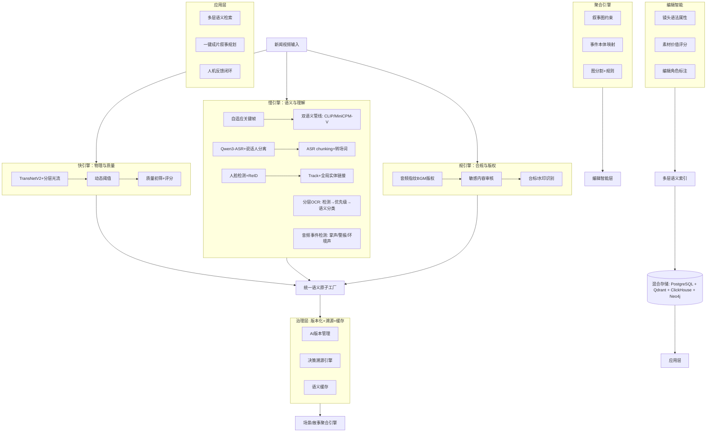

# 面向时政新闻的智能媒资与视频结构化全流程技术方案（v4.1 完全体）

> 版本：v4.1 — 基于 v4.0 整合 20 项架构决策 + 工程化落地方案
> 日期：2026 年 5 月 21 日
> 场景：本地融媒体中心 · 时政新闻媒资管理
> 团队：1-2 人
> 硬件：验证阶段 2080Ti 22GB → 生产阶段 L20 48GB × 2 + 国产卡（型号待定）
> 业务规模：10-50 小时视频/天（以 30 分钟新闻节目为主）
> 压力：无交付时间压力，稳步推进
> 技术栈：FastAPI (后端) + Vue 3 + Element Plus (前端) + PostgreSQL (pgvector + ltree) + Milvus Lite + Celery + Redis + MinIO
>
> ### v4.1 更新说明
> 本版本在 v4.0 基础上，整合了通过 Grill-Me 流程确定的 20 项核心架构决策：
> - 确定插件化架构：新建 `module_vms` 插件，独立于 `module_lamice`
> - 确定模块划分：shared / governance（横切服务）/ ingestion / analysis / review / production
> - 确定存储方案：PostgreSQL + Milvus Lite + MinIO + Redis 混合存储
> - 确定任务编排：Celery + Redis（gpu/cpu/io 三队列）
> - 确定推理网关：混合方案（通用 LLM 走 module_ai，专用模型走 VMS 内部）
> - 确定知识图谱：PostgreSQL + NetworkX + ltree
> - 确定 MVP 范围和实施优先级（P0/P1/P2）
> - 补充完整的工程化设计（API 规范、可观测性、测试策略、安全合规、媒资库对接）
> 基础框架：FastapiAdmin（module_vms 插件）
> 视频来源：混合来源（卫星 TS 流 + 非编系统导出 + 已有文件）
> 输出需求：JSON API + Web 界面 + 对接其他系统 + 广电标准编目数据
> 用户：编辑/记者为主
> 存储：需新建存储系统

> **注意**：方案中所有模型精度指标均为公开论文/评测数据，**未在时政新闻场景实测**。各阶段开始前需先标注 50-100 条测试样本，验证模型在实际数据上的表现。

## 核心设计哲学

精准拆分是骨架，统一语义是神经，版本治理是免疫，知识编辑是大脑，人机协同是进化。

---

## 目录

- [第一章 项目背景与目标](#第一章-项目背景与目标)
- [第二章 总体架构设计](#第二章-总体架构设计)
  - [2.8 视频接入与格式处理层](#28-视频接入与格式处理层)
- [第三章 核心技术模块详解](#第三章-核心技术模块详解)
  - [3.1 治理层：版本化 + 决策溯源 + 语义缓存 + 本体版本 + 输出护栏 + Prompt 管理](#31-治理层版本化--决策溯源--语义缓存)
  - [3.2 知识层：全局实体注册表 + 事件本体 + 知识图谱 + Face-Voice 关联 + 事件演化图](#32-知识层全局实体注册表--事件本体--知识图谱)
  - [3.3 基础层：视频结构化 + 输入异常边界处理](#33-基础层视频结构化)
  - [3.4 语义层：多模态标注 + 字幕合成](#34-语义层多模态标注)
  - [3.5 审查层：质量 + 技术 + 安全 + 版权 + 编目 + AI 风险分级 + AIGC 溯源](#35-审查层质量--技术--安全--版权--编目)
  - [3.6 智能层：编辑智能 + 一键成片 + 美学评分 + 编辑推荐 + Workflow 模板](#36-智能层编辑智能--一键成片)
  - [3.7 人机协同：反馈闭环 + 标注 SOP + 主动学习 + Agent 规划](#37-人机协同反馈闭环--agent-规划)
- [第四章 模型选型与部署](#第四章-模型选型与部署)
- [第五章 数据存储与索引设计](#第五章-数据存储与索引设计)
  - [5.5 存储容量规划](#55-存储容量规划)
- [第六章 数据结构设计](#第六章-数据结构设计)
- [第七章 性能评估](#第七章-性能评估)
- [第八章 工程化设计](#第八章-工程化设计)
  - [8.8 技术栈选型](#88-技术栈选型)
  - [8.9 系统集成设计](#89-系统集成设计)
  - [8.10 前端 MVP 设计](#810-前端-mvp-设计)
  - [8.11 监控与健康检查](#811-监控与健康检查)
  - [8.12 AI 运维与成本统计](#812-ai-运维与成本统计)
  - [8.13 模型升级与向量迁移](#813-模型升级与向量迁移)
  - [8.14 FastapiAdmin 框架集成策略](#814-fastapiadmin-框架集成策略)
- [第九章 实施路线图](#第九章-实施路线图)
  - [9.5 验收体系与评测基准](#95-验收体系与评测基准)
  - [9.6 接口与交换标准](#96-接口与交换标准)
  - [9.7 备份恢复与数据生命周期](#97-备份恢复与数据生命周期)
  - [9.8 权限与多租户](#98-权限与多租户)
- [第十章 未来演进方向](#第十章-未来演进方向)
  - [10.7 配置预留项](#107-配置预留项)
  - [10.8 组织治理建议](#108-组织治理建议)
- [第十一章 总结](#第十一章-总结)

---

## 第一章 项目背景与目标

### 1.1 项目背景

#### 行业现状与挑战

时政新闻媒资管理面临海量视频素材的快速入库、精准检索、安全合规和高效剪辑四大核心挑战。传统人工编目方式效率低下，一条 30 分钟新闻视频需要 1-2 小时人工标注，且质量因人而异。检索依赖关键词匹配，无法理解视频内容的深层语义关系。内容安全与版权审核依赖人工审查，覆盖不全、风险较高。一键成片功能缺乏编辑级语义支撑，自动剪辑质量难以满足播出要求。

#### AI 技术驱动转型

多模态大模型（VLM）、视觉语言理解、语音识别（ASR）、向量检索等 AI 技术的快速发展，为媒资系统智能化转型提供了技术基础。本地部署的推理框架（如 Ollama、vLLM）使中小团队能够以可控成本部署先进 AI 能力，满足数据安全与信创要求。

#### 国家政策要求

国家信创战略要求关键行业系统使用国产技术栈。媒资系统作为新闻生产的核心基础设施，必须具备数据本地化存储、模型自主可控、可审计溯源等特性。

### 1.2 业务痛点

| 痛点 | 具体表现 |
|------|----------|
| 海量视频入库效率低 | 人工编目成本高，一条 30 分钟视频需要 1-2 小时标注 |
| 检索粒度粗 | 仅支持关键词检索，无法按镜头、场景、故事维度精准检索 |
| 多模态信息割裂 | 语音、文字、人脸、环境信息分散存储，形成信息孤岛 |
| 内容安全与版权合规难 | 依赖人工审查，覆盖不全、风险高、时效性差 |
| 一键成片质量差 | 缺乏编辑级语义支撑，自动剪辑可用率低于 30% |

### 1.3 建设目标

1. **像素级镜头边界检测** — 物理切分零遗漏、零过切（TransNetV2 论文数据准确率 98.2%，**待实测验证**）
2. **叙事级场景聚合** — 将镜头按新闻逻辑组合为有意义的"新闻包"
3. **人物轨迹追踪** — 跨镜头人员关联与出镜统计（人脸库从零构建）
4. **多维度时间轴标注** — 人物、语音、环境、OCR、版权与时间轴对齐
5. **统一语义原子** — 融合 ASR/OCR/人脸/事件等多模态信息，消除信息孤岛
6. **自动化质量与技术审查** — 废镜头提醒、黑场/静帧/静音告警
7. **内容安全与版权检测** — BGM 版权、敏感词、敏感画面、台标识别（目标自动化率 >90%）
8. **编辑智能支撑** — 镜头语法、叙事角色、节奏引擎，为高级成片服务
9. **日处理 10-50 小时视频** — 验证阶段 2080Ti 22GB，生产阶段 L20 48GB × 2

### 1.4 预期效益

| 指标 | 提升幅度 |
|------|----------|
| 编目效率 | 10x+（待实测） |
| 素材检索命中率 | 3-5x（待实测） |
| 内容安全审核自动化率 | 目标 >90% |
| 一键成片初剪可用率 | 目标 >70% |
| 单机日处理能力 | 10-50 小时视频（实际需求），硬件可支撑 60-75 小时 |

---

## 第二章 总体架构设计

### 2.1 架构总览

系统采用 9 层架构，实现从"标签系统"到"新闻认知系统"的跃升：

```
L9: 人机协同与进化层 (Human-AI Collaboration & Feedback Loop)
    编辑操作日志 → 反馈信号 → 分类器/排序/模板持续微调

L8: 编辑智能与自动成片 (Editorial Intelligence & Auto-Production)
    镜头语法引擎 / 素材质量-价值评分 / 叙事结构规划 / Agent 规划 / 节奏引擎

L7: 应用与检索层 (Application & Retrieval)
    多模态多层语义检索 / 一键成片接口 / 智能剪辑工作台 / 合规审查面板

L6: 知识图谱层 (Knowledge Graph)
    全局实体注册表 / 新闻事件本体 / 实体关系图 / 素材谱系图

L5: 语义聚合与编目 (Semantic Aggregation & Cataloging)
    Story/Scene 聚合 (图分割 + 叙事图 + 本体) / 自动编目 / 事件抽取

L4: 统一语义原子层 (Unified Semantic Atom — 系统神经中枢)
    多模态实体归一 / 原子生成 / 向量化表达

L3: 治理与保障层 (Governance & Provenance — 系统免疫系统)
    AI 版本管理 / 决策溯源引擎 / 语义缓存 / 熔断降级 / 敏感词双人复核

L2: 多维分析引擎 (Multi-Dimensional Analysis Engines)
    物理拆分 (快引擎) / 语义理解 (慢引擎, 双管线) / 合规审查 (规引擎)

L1: 硬件与基础设施 (Infrastructure)
    混合存储 (PG + Qdrant + ClickHouse + Neo4j + MinIO) / 任务编排 (Celery/Argo) / 分布式调度
```

```
┌─────────────────────────────────────────────────────┐
│ 应用层：多层语义检索 | 一键成片叙事规划 | 人机反馈    │
├─────────────────────────────────────────────────────┤
│ 智能层：镜头语法 | 质量评分 | 素材谱系 | Agent 规划  │
├─────────────────────────────────────────────────────┤
│ 审查层：质量审查 | 技术审查 | 安全审核 | 版权检测   │
├─────────────────────────────────────────────────────┤
│ 语义层：语义原子 | 双语义管线 | 多模态标注            │
├─────────────────────────────────────────────────────┤
│ 知识层：全局实体注册表 | 事件本体 | 知识图谱          │
├─────────────────────────────────────────────────────┤
│ 治理层：版本化 | 决策溯源 | 语义缓存               │
├─────────────────────────────────────────────────────┤
│ 基础层：镜头切分 | Track 轨迹 | 场景聚合 | 故事分割  │
└─────────────────────────────────────────────────────┘
```

### 2.2 三引擎联动架构

系统由三个并行引擎协同工作，实现"快慢结合、规则与模型联动"：



### 2.3 快引擎：物理与质量层

负责视频的物理拆分与质量初筛，要求速度快、精度高：

- **TransNetV2 + 分层运动估计** — 硬切检测准确率 98.2%
- **动态阈值重扫机制** — 对高风险边界做稠密光流精扫
- **质量初筛** — 过曝/偏色/晃动/模糊/黑场/静帧/静音检测

### 2.4 慢引擎：语义与理解层

负责多模态语义理解，可异步批处理：

- **自适应关键帧抽取** — 静态/主播/高频运动镜头差异化采样，节约 50% VLM 推理
- **双语义管线** — CLIP 检索向量（稳定）+ MiniCPM-V 深度理解
- **ASR 词级转写 + 说话人分离** — Qwen3-ASR-1.7B vLLM 部署
- **人脸检测/识别/ReID/Track** — RetinaFace + ArcFace + CLIP 去重
- **分层 OCR** — 检测 → 优先级判定 → 语义分类
- **音频事件检测** — 掌声/警报/环境声/哭泣/欢呼

### 2.5 规引擎：合规与版权层

负责内容安全与版权检测，独立部署、严格审计：

- **音频指纹 BGM 版权检测** — Chromaprint + Acoustid/自建库
- **内容安全审核** — 敏感词库 + 专用审核模型
- **视觉合规** — 台标/水印/Logo 识别
- **自动编目** — 事件抽取 + 事件图谱

### 2.6 统一语义原子工厂

将所有引擎输出融合为统一语义原子：

```json
{
  "atom_id": "a1",
  "type": "person",
  "text": "张三",
  "time_range": {"start_ms": 0, "end_ms": 5000},
  "source": ["Face", "OCR"],
  "confidence": 0.95,
  "embedding": [0.1, 0.2, ...],
  "relations": {"global_entity_id": "person_zhang_san"},
  "decision_reason": ["FACE_MATCH_0.95", "OCR_NAME_MATCH"]
}
```

### 2.7 核心创新点

| 创新点 | 说明 |
|--------|------|
| Track 轨迹层 | 跨镜头人员追踪，国内时政新闻媒资系统首创 |
| 语义原子 | 统一抽象层，消除多模态信息孤岛 |
| 双语义管线 | CLIP 检索与 MiniCPM-V 理解分离，各司其职 |
| 多层语义索引 | Shot/Scene/Story/Event 四级向量体系 |
| 时序融合检索 | 粗召回 → 语义重排 → 时序合并 |
| AI 决策溯源 | 关键决策点可解释、可审计 |
| 编辑智能层 | 从"自动标注"到"编辑知识"的质变 |
| 人机反馈闭环 | 系统持续学习与进化能力 |

### 2.8 视频接入与格式处理层

系统需对接融媒体中心的多源视频输入，统一处理后再进入三引擎流水线。

#### 2.8.1 视频来源与接入方式

| 来源 | 接入方式 | 说明 |
|------|----------|------|
| 卫星接收 TS 流 | FFmpeg 实时转封装 | 卫星收录的 MPEG-TS 流，需解复用后转 MP4/MKV |
| 非编系统导出 | 文件系统监控目录 | 编辑完成后导出到指定目录，Watchdog 自动检测新文件 |
| 已有媒资文件 | 批量导入 API | 支持手动触发批量导入历史素材 |
| 外部传输 | 上传接口 | Web 上传或 FTP/SFTP 接收 |

#### 2.8.2 格式兼容策略

| 格式类型 | 常见编码 | 处理策略 |
|----------|----------|----------|
| MXF | AVC-Intra, DNxHD | FFmpeg 解码，保留原始元数据 |
| TS/MTS | MPEG-2, H.264 | 转封装为 MP4，不重编码 |
| MP4/MOV | H.264, H.265 | 直接处理 |
| ProRes | Apple ProRes 422/4444 | FFmpeg 解码，注意大文件分片 |
| 其他格式 | 多种 | FFmpeg 自动探测，失败则标记待人工确认 |

**统一预处理流程**：

```
原始文件 → FFmpeg 探测格式/编码 → 异常格式告警
    → 统一转封装为 MP4（不重编码）
    → 提取音频轨（WAV 16kHz，ASR 专用）
    → 生成代理文件（720p H.264，Web 预览用，严格同步原始时间码）
    → 计算文件指纹（MD5 + pHash 双层去重）
    → 入队等待三引擎处理
```

**文件就绪检测（混合策略）**：

Watchdog 监控非编导出目录时，采用混合策略判断文件写入完成：
1. **优先命名约定** — 非编导出先写 `.tmp` 后缀，完成后 rename 为正式文件名（需配置非编系统）
2. **回退文件锁检测** — 用 `lsof`/`fuser` 检测文件是否被占用 + 文件大小连续 30 秒不变才触发

**视频去重（MD5 + pHash 双层）**：

- **第一层**：MD5 精确匹配，检测完全相同的文件
- **第二层**：关键帧 pHash 感知哈希（汉明距离 ≤ 5），检测同一内容的不同编码版本（MXF/MP4/TS）

#### 2.8.3 与现有媒资系统的对接

现有媒资库无 API 接口，采用文件级同步策略：

- **导入同步**：定期扫描媒资库的 NAS 存储目录（通过 SMB/NFS 挂载），检测新增/修改文件
- **元数据关联**：从文件命名规则和目录结构推断基础元数据（节目名称、日期等）
- **结果回写**：处理结果以 JSON 文件形式存储到对应目录，便于其他系统读取
- **长期演进**：预留 API 接口设计，待现有系统开放接口后切换

---

## 第三章 核心技术模块详解

### 3.1 治理层：版本化 + 决策溯源 + 语义缓存

#### 3.1.1 AI 版本管理系统

所有 AI 输出强制携带版本信息：

```json
{
  "model": "MiniCPM-V-4.6",
  "model_version": "2026.05",
  "prompt_version": "scene_v2",
  "embedding_version": "clip_cn_v3"
}
```

**版本管理表**记录各模型版本生命周期，支持按时间点重建索引。**Embedding 迁移策略**应对向量模型升级导致的漂移问题。

#### 3.1.2 决策溯源引擎

关键决策点强制记录溯源信息：

- `scene_boundary_reason` — 场景边界判断依据
- `event_extraction_reason` — 事件抽取依据
- `editorial_role_reason` — 编辑角色标注依据

审核决策强制记录溯源信息，提供人工审计接口与报告生成。

**审计日志存储** — 使用 PostgreSQL 独立 JSONB 审计表（`audit_logs`），记录所有 AI 决策详情。支持"为什么这条新闻被标记为涉政"类审计查询。

#### 3.1.3 语义缓存层

基于素材指纹（pHash）建立缓存键，缓存项包括：

- OCR 结果
- CLIP embedding
- VLM 摘要
- 人脸识别结果

缓存失效策略与版本联动，预计降低 30%-50% GPU 调用量。

#### 3.1.4 统一本体版本管理

除模型版本和 embedding 版本外，以下知识资产同样需要版本管理：

| 版本对象 | 版本标识 | 变更触发 | 影响 |
|----------|----------|----------|------|
| 事件本体 | `ontology_v1.2` | 新增/修改事件类型 | Story 聚合、事件抽取 |
| 编辑角色字典 | `role_dict_v2` | 新增编辑角色定义 | 镜头语法引擎 |
| 字段字典 | `field_dict_v1` | 编目字段增删 | 自动编目、导出 |
| 敏感词库 | `sensitive_v3` | 增删敏感词 | 内容安全审核 |

每次版本变更记录变更内容、操作人、审批状态。本体回滚时，依赖该本体的 AI 输出标记为「待重新处理」。

#### 3.1.5 结构化输出护栏

语义原子工厂增加输出校验层，确保 AI 输出质量：

- **JSON Schema 校验** — 每个 Provider 输出对应预定义的 JSON Schema，校验字段完整性和类型正确性
- **关键字段非空检查** — `atom_id`、`type`、`time_range` 必填字段缺失则拒绝入库
- **异常值过滤** — 置信度 > 1.0 或 < 0.0、时间戳超出视频时长等异常自动过滤
- **重试机制** — Schema 校验失败时自动重试（最多 2 次），仍失败则标记为「待人工处理」

#### 3.1.6 Prompt 配置管理

所有 AI 调用的 Prompt 模板以配置文件管理：

```
module_vms/config/prompts/
├── minicpmv/
│   ├── scene_summary_v1.yaml
│   └── shot_analysis_v1.yaml
├── clip/
│   └── classification_v1.yaml
└── sensitive/
    └── context_check_v1.yaml
```

每个 Prompt 文件包含：模板内容、版本号、适用模型、输入输出 Schema。`prompt_version` 字段与 AI 版本管理系统联动。

### 3.2 知识层：全局实体注册表 + 事件本体 + 知识图谱

#### 3.2.1 全局实体注册表（Global Entity Registry）

跨视频实体统一标识，多模态实体归一：

```json
{
  "global_entity_id": "person_trump",
  "names": ["特朗普", "Donald Trump", "川普"],
  "face_features": [0.1, 0.2, ...],
  "voice_features": [0.3, 0.4, ...],
  "event_history": ["event_001", "event_005", ...]
}
```

Semantic Atom 局部实体 → 全局实体链接，实现跨视频人物关联。

#### 3.2.2 新闻事件本体（Event Ontology）

层次化事件本体设计：

```
国际关系
├── 外交
│   ├── 国事访问
│   ├── 首脑会谈
│   └── ...
├── 贸易
│   ├── 政策发布
│   ├── 贸易谈判
│   └── ...
└── ...
```

事件抽取结果映射到本体节点，Story 聚合基于本体距离。

**冷启动策略** — 预置中国政治人物本体（国家/省级领导人层级）+ 常见新闻事件类型（外交/经济/民生/灾难）。编辑在日常使用中逐步补充。避免前 100 条视频处理时本体为空。

#### 3.2.3 知识图谱

Neo4j 与知识层同步引入。虽然增加运维成本，但实体关系查询是核心能力，PostgreSQL CTE 替代方案严重限制功能。

四层图谱结构：

| 图层 | 内容 |
|------|------|
| Entity Graph | 人物/机构/地点实体关系 |
| Event Graph | 事件时序与因果关系 |
| Media Graph | 媒资素材关联关系 |
| Temporal Graph | 时间轴语义关系 |

Neo4j 存储与查询，支撑一键成片事件级检索。

#### 3.2.4 Face-Voice 关联

实体注册表增加声纹维度：

```json
{
  "global_entity_id": "person_trump",
  "face_features": [0.1, 0.2, ...],
  "voice_features": [0.3, 0.4, ...],
  "voice_print_id": "vp_001"
}
```

Speaker Diarization 输出的说话人片段关联到人物实体：
- 人脸 Track 与说话人时间段重叠 → 自动关联
- 关联结果存入 Atom 层（`type: "person_speaking"`）
- 跨视频声纹匹配为远期扩展，初期仅视频内关联

#### 3.2.5 事件演化图

在事件本体基础上，补充事件演化维度：

- **事件时间线** — 同一主题事件按时间排序，形成「事件链」
- **演化状态标记** — `发生 → 发展 → 后续 → 跟踪 → 归档`
- **关联事件发现** — 基于实体重叠（同一人物/机构参与的不同事件）自动关联

事件演化图为一键成片提供「事件全景」视角，编辑可按事件链检索相关素材。

### 3.3 基础层：视频结构化

#### 3.3.1 极致精准的镜头切分

**TransNetV2 硬切检测** — 准确率 98.2%（论文数据，**待实测**），检测像素级边界。

**分层运动估计（补充软切检测）**：
- 第一层：块匹配粗筛（极轻量）
- 第二层：仅对"高运动复杂度片段"做稠密光流（精扫）

> **验证计划**：先用 TransNetV2 + 分层运动估计双步方案跑测试集，再对比 BAMFM/BTCV 等更新模型，全方位对比后决定最终方案。时政新闻中字幕切换、叠化等软切场景是关键评估维度。

**动态阈值重扫** — 对高风险边界做二次检测，确保零遗漏。

**输入格式异常边界处理**：

| 异常类型 | 检测方式 | 处理策略 |
|----------|----------|----------|
| 变帧率（VFR） | FFProbe `avg_frame_rate` 变化 | 统一转 CFR 再切分 |
| 隔行扫描 | FFProbe `field_order` ≠ progressive | deinterlace 滤镜预处理 |
| 掉帧 | 帧时间戳间隔 > 2× 平均间隔 | 标记「掉帧区间」，镜头边界降信 |
| 音轨缺失 | FFProbe 无 audio stream | 标记「无声频」，跳过 ASR/音频分析 |
| 多音轨 | FFProbe audio streams > 1 | 选择主音轨（声道数最多），其余存为备用 |
| 双语字幕 | OCR 检测多行字幕区域 | 分别识别，标注语言类型 |
| 黑边 | FFmpeg `cropdetect` | 自动裁切，记录原始尺寸 |
| 混码率 | 码率波动 > 50% | 按码率变化点分段处理 |
| 超长节目（>2h） | 时长检测 | 自动分片（30 分钟重叠），并行处理后合并 |
| 直播切片回灌 | 文件大小持续增长 | 等文件稳定后处理（文件锁检测） |

处理流程：
```
FFmpeg 解码 + NVDEC 运动向量
    ↓
TransNetV2 初步边界
    ↓
分层运动估计精扫
    ↓
动态阈值重扫
    ↓
精确边界输出
```

#### 3.3.2 自适应关键帧抽取

差异化采样策略：

| 镜头类型 | 采样策略 |
|----------|----------|
| 静态镜头 | 首尾帧 + 中间 1 帧 |
| 主播镜头 | 每 5 秒采样 |
| 高频运动镜头 | 每 2 秒采样 |

预计节约 50% VLM 推理调用。

#### 3.3.3 人物轨迹追踪（Track Layer）

**RetinaFace + ArcFace** 人脸检测识别（FP16 TensorRT，30 fps）。

**CLIP 相似度 / pHash 去重** — 减少 60% 计算量。

**ReID 跨镜头追踪** — 人脸特征 + IoU + 时间约束。

Track 结构输出：
```json
{
  "track_id": "t_001",
  "entity_type": "person",
  "shot_ids": ["shot_001", "shot_003", "shot_005"],
  "time_range": {"start_ms": 0, "end_ms": 30000},
  "representative_bbox": [100, 200, 300, 400]
}
```

Track 对场景聚合的增强作用 — 同一人物连续出镜的场景自动聚合。

**人脸库构建策略（混合方式）**：

人脸库从零构建，采用"聚类发现 + 照片锚定"混合策略：
1. **聚类发现** — 系统从视频中自动提取人脸特征，按相似度聚类（ArcFace 余弦相似度 > 0.6），生成未命名身份簇
2. **照片锚定** — 编辑上传标准人物照片（1-3 张），系统计算特征向量作为锚点，自动匹配聚类簇
3. **Web 界面命名** — 编辑在 Web 界面查看未命名聚类，批量命名或与已有实体关联

#### 3.3.4 叙事级场景与故事聚合

**图分割 + 叙事图 + 本体三重驱动**：

1. **图分割（图算法）**
   - 镜头为节点，边权由以下因素决定：
     - 视觉相似度（CLIP 向量余弦）
     - 语音连续度（说话人切换）
     - OCR 主题延续（文本相似度）
     - Track 连续度（同一人物跨镜头）
   - 社区发现（Louvain 算法）预聚合
   - **权重可调** — 按新闻类型（时政/民生/体育）预设不同权重配置，编辑可在 Web 界面调整

2. **规则增强**
   - ASR 强制转场词作为硬边界（"接下来"、"下面"、"让我们看看"等）

3. **叙事图约束**
   - 基于「新闻事件本体」和「叙事结构模板」进行二次聚合
   - 确保聚合结果符合新闻叙事逻辑

### 3.4 语义层：多模态标注

#### 3.4.1 统一语义原子（Semantic Atom）

原子结构设计：
```json
{
  "atom_id": "a1",
  "type": "person|location|organization|event|...",
  "text": "实体文本",
  "time_range": {"start_ms": 0, "end_ms": 5000},
  "source": ["Face", "OCR", "ASR", "Event"],
  "confidence": 0.95,
  "embedding": [0.1, 0.2, ...],
  "relations": {"global_entity_id": "person_xxx"},
  "decision_reason": ["FACE_MATCH_0.95"]
}
```

多源信息对齐机制，实体归一（Entity Canonicalization）。

#### 3.4.2 双语义管线

| 管线 | 模型 | 用途 |
|------|------|------|
| CLIP 管线 | 中文 CLIP / SigLIP2 | 稳定检索向量，用于 ANN 检索 |
| MiniCPM-V 管线 | MiniCPM-V 4.6 | 深度语义理解，镜头类型/场景描述/环境识别 |

检索与理解分离的设计哲学 — CLIP 负责稳定检索，MiniCPM-V 负责深度理解。

#### 3.4.3 ASR 语音转写与增强

**Qwen3-ASR-1.7B vLLM 部署** — 验证阶段单路串行，L20 生产阶段 2-3 路并发。

**ASR 音频分段** — 用 VAD（语音活动检测）智能分段（~30 秒/段），避免固定分段切断句子。

**转场词识别** — "接下来"、"下面"、"让我们看看"等转场词用于场景边界判断。

**ASR chunking + topic segmentation** — 长文本按话题分片，提升检索效率。

#### 3.4.4 说话人分离（Speaker Diarization）

**pyannote/speechbrain** 独立部署，支持在线/离线模式。

说话人分离与聚类，说话人时间线层：
```json
{
  "speaker_id": "spk_001",
  "role": "anchor|reporter|interviewee|...",
  "time_range": {"start_ms": 0, "end_ms": 5000},
  "global_entity_id": "person_xxx"
}
```

说话人 ID 与全局实体注册表链接。

#### 3.4.5 分层 OCR 处理

**第一层**：轻量文本检测（PaddleOCR）

**第二层**：区域优先级判定
- 高价值：字幕区、标题区、屏幕文字
- 中等：人名条、滚屏文字
- 低价值：背景文字

**第三层**：语义 OCR 分类
- `headline` — 标题
- `speaker_name` — 人名
- `location` — 地点
- `data_label` — 数据标签

仅高价值区域做全精度识别，预计节约 40%-60% 计算。

**OCR 纠错（实体库模糊匹配）**：

OCR 结果（尤其人名、地名）常有错别字。系统将 OCR 文本与全局实体注册表做模糊匹配（编辑距离 ≤ 2），自动纠正已知实体名。如"特明普" → "特朗普"。

#### 3.4.6 音频事件检测

掌声/警报/环境声/哭泣/欢呼等事件识别，音频事件时间轴与视频时间轴对齐。

#### 3.4.7 字幕合成与多格式导出

ASR 结果支持多格式导出：

| 格式 | 用途 | 特点 |
|------|------|------|
| SRT | 通用字幕 | 时间轴精确到毫秒，广泛兼容 |
| VTT | Web 播放 | 支持样式，HTML5 video 原生支持 |
| ASS | 非编系统 | 支持复杂排版、字体、位置控制 |

OCR 字幕区域定位 — 识别视频中原有字幕的位置和内容，记录为字幕层元数据（`subtitle_region`），用于：
- 字幕去重（区分 ASR 新增字幕和原有字幕）
- 字幕位置避让（新增字幕不覆盖原有字幕区域）
- 字幕翻译（双语字幕场景）

### 3.5 审查层：质量 + 技术 + 安全 + 版权 + 编目

#### 3.5.1 质量审查（废镜头提醒）

检测项：过曝/欠曝/偏色/晃动/模糊/黑场/静帧/静音

输出：每个镜头的 `quality_alert`
```json
{
  "type": "overexposure",
  "confidence": 0.95,
  "is_confirmed": true,
  "value": 0.85
}
```

FFmpeg 滤镜辅助检测（freezedetect/silencedetect/blackframe）。

#### 3.5.2 技术审查（播出安全）

- 信号质量评估
- 音频电平检测
- 视频编码合规检查

输出：`qc_events` 数组。

#### 3.5.3 内容安全审核

**敏感词库管理** — 双人复核 + 紧急权限机制

**敏感词匹配策略** — 关键词命中后用 MiniCPM-V 做 LLM 上下文判断，降低误报率。如"杀毒"不应命中"杀"字敏感词。

**敏感画面检测** — 专用审核模型（如 PornNet）或云端 API

**审核结果分级** — 高/中/低风险，自动处置建议

**AI 风险分级** — 对所有 AI 输出按风险等级分类：

| 风险等级 | 判定条件 | 处理流程 |
|----------|----------|----------|
| 高风险 | 涉政关键词命中 + 人脸识别为国家领导人 | 自动阻断 + 双人复核 + 审批后放行 |
| 中风险 | 敏感词命中但 LLM 判断为非敏感语境 | 标记待复核，编辑 24 小时内确认 |
| 低风险 | 技术质量告警、非涉政内容 | 自动处理，编辑可后续调整 |

**AIGC 溯源标记** — 所有 AI 生成/增强内容强制标记：

- Atom/Scene 增加 `is_ai_generated` 字段
- AI 参与的编目字段标注 AI 来源和模型版本
- 一键成片输出带 AI 参与度水印（「本片由 AI 辅助生成，AI 参与度 XX%」）
- 遵循国家《生成式 AI 服务管理暂行办法》标识要求

输出：`content_safety` 标签 + `compliance_summary` + `risk_level` + `ai_provenance`。

#### 3.5.4 版权检测

| 检测项 | 技术手段 |
|--------|----------|
| BGM 版权 | Chromaprint 音频指纹 + Acoustid 公共库（本地缓存命中结果） |
| 反动/敏感歌曲 | ASR 歌词 + 敏感词库；音频指纹黑库比对 |
| 脏话检测 | Demucs 人声分离 + ASR + NLP 分类 |

输出：`bgm_info` 数组，包含匹配歌曲、版权状态、时间区间。

#### 3.5.5 自动编目

按广电编目标准自动生成结构化元数据：

```json
{
  "catalog_id": "cat_001",
  "title": "中美贸易最新进展",
  "category": "国际关系",
  "keywords": ["中美贸易", "商务部", "政策"],
  "events": ["event_001", "event_002"]
}
```

事件抽取与事件图谱构建，编目信息标准化输出。

### 3.6 智能层：编辑智能 + 一键成片

#### 3.6.1 镜头语法引擎（Shot Grammar Engine）

镜头属性标注：
- 景别（wide/medium/close）
- 角度（front/side/top）
- 运动（static/pan/tilt/zoom）
- 构图（rule-of-thirds/center）

编辑角色标注：
- `opening_establishing` — 开场建立镜头
- `interview` — 采访镜头
- `cover` — 遮挡镜头
- `b_roll` — 辅助镜头
- `emotional_cutaway` — 情感切出
- `closing` — 结尾镜头

编辑角色理由记录（`editorial_role_reason`）。

#### 3.6.2 素材质量评分与价值评估

三维评分体系：
- `technical_score` — 技术质量（0-1）
- `editorial_score` — 编辑价值（0-1）
- `semantic_score` — 语义丰富度（0-1）
- `importance_score` — 综合重要性（0-1）

素材价值特征：
- 人物等级（国家领导人/重要官员/普通人物）
- 稀缺性（独家/广泛/常见）
- 时效性（最新/近期/历史）

自动成片时基于评分优先选择高价值素材。

#### 3.6.3 视觉美学评分

在镜头语法引擎基础上，补充美学维度：

- **构图评分** — 三分法/对称性/黄金比例检测（基于关键帧几何分析）
- **色彩和谐度** — 基于色彩直方图的和谐度评估（互补色/类似色/三色组）
- **画面稳定性** — 光流幅值方差，区分「手持新闻感」与「不可用晃动」

美学评分作为 `aesthetic_score`（0-1）纳入素材评分体系，权重低于技术质量分和编辑价值分。

#### 3.6.4 编辑推荐引擎

基于编辑历史的轻量推荐：

- **常用镜头偏好统计** — 记录编辑常选的景别/角度/时长，构建偏好向量
- **基于历史推荐** — 检索结果按编辑偏好加权排序
- **热门素材标识** — 被多个编辑/多次选用的素材标记「热门」

推荐权重随编辑行为实时更新，不引入协同过滤等复杂算法。

#### 3.6.5 Workflow 编辑模板

预设新闻编辑流程模板：

| 模板 | 适用场景 | 步骤 |
|------|----------|------|
| 简讯模板 | 30 秒 - 2 分钟短新闻 | 选题 → 自动检索 → 粗剪 → 审查 |
| 专题模板 | 5 - 15 分钟专题报道 | 选题 → 素材筛选 → 叙事规划 → 多段剪辑 → 审查 |
| 直播初剪 | 长时间直播快速出片 | 导入 → 场景分割 → 精彩段标记 → 粗剪 |

编辑可在 Web 界面自定义模板，调整步骤和参数。

#### 3.6.6 素材谱系图（Asset Lineage Graph）

同一素材的多版本关联：
```json
{
  "asset_lineage": {
    "canonical_id": "asset_001",
    "derived_from": null,
    "versions": [
      {"version": "original", "path": "..."},
      {"version": "captioned", "path": "..."},
      {"version": "low_bitrate", "path": "..."}
    ]
  }
}
```

素材可追溯性核心。

#### 3.6.4 一键成片 — 叙事规划

**多种输入方式** — 编辑可选择：
1. **关键词 + 时长** — 输入主题关键词和目标时长，系统自动检索编排
2. **自然语言描述** — 写一段文字描述想要的新闻内容，系统理解后检索编排
3. **结构化选择** — 选择事件/人物，按模板生成

**Step 1：理解稿件** — DeepSeek-V3/Qwen3.5 生成文案

**Step 2：拆解叙事结构** — 导语/采访/空镜/结尾

**Step 3：事件级素材检索** — 基于事件本体检索，而非简单关键词

**Step 4：镜头级排序与约束** — 镜头语法约束、编辑角色匹配

#### 3.6.5 一键成片 — 节奏引擎

新闻类型差异化节奏：
- 国际时政：慢节奏、长镜头、庄重
- 社会新闻：快节奏、多切换、生动

镜头时长与切换速度动态调节。

语音合成配音（CosyVoice2/Edge-TTS）。

### 3.7 人机协同：反馈闭环 + Agent 规划

#### 3.7.1 编辑反馈学习（Editorial Feedback Learning）

**完整闭环设计**：

1. **操作记录** — 记录编辑对 Shot/Story/事件的修改、删除、重排序操作
2. **信号转化** — 将操作日志转化为**反馈信号**
3. **模型微调** — 反馈信号用于微调：
   - 分类器（镜头类型、场景分类）
   - 重排序模型（检索排序）
   - 叙事模板（成片结构）
4. **权重衰减** — 反馈信号权重随时间衰减，系统持续进化

反馈信号示例：
```json
{
  "operation": "shot_boundary_adjust",
  "from": 5000,
  "to": 4800,
  "reason": "cut_too_late",
  "timestamp": "2026-05-20T10:00:00Z",
  "weight": 1.0
}
```

#### 3.7.2 标注与反馈闭环 SOP

**谁能改** — 具备编辑角色的系统用户可修改 AI 输出。

**怎么改** — 通过 Web 界面直接编辑：调整镜头边界、修改场景标签、纠正 OCR 结果、关联/解除实体。

**改后回写到哪层**：

| 修改类型 | 回写层 | 生效方式 |
|----------|--------|----------|
| 镜头边界调整 | Shot 层 + 语义缓存失效 | 即时 |
| 场景标签修改 | Scene 层 + 向量更新 | 即时 + 异步重建向量 |
| OCR 纠正 | Atom 层 + 实体注册表 | 即时 |
| 实体关联/解除 | 全局实体注册表 + 知识图谱 | 即时 |
| 事件分类调整 | 事件本体 + Story 层 | 即时 |
| 编辑角色修改 | Shot 层 + 反馈信号 | 即时 + 异步微调 |

**多久生效** — 即时生效（数据库直接更新），向量/模型相关更新异步处理（通常 <1 分钟）。

**审计审批** — 涉政内容修改自动进入审批流，需双人复核；其他修改记录审计日志但不强制审批。

#### 3.7.3 主动学习

系统自动识别低置信度样本，推送编辑复核：

- Atom 置信度 < 0.6 → 标记为「待复核」
- Scene 聚合边界不确定度 > 阈值 → 推送编辑确认
- 新实体首次出现 → 推送编辑确认实体名

编辑复核结果自动回流到反馈学习系统，形成「系统提问 → 编辑回答 → 模型进化」的闭环。

#### 3.7.4 Agent 编辑规划层（远期）

Agentic Editorial Planner：
- 多步骤规划：选题 → 素材检索 → 叙事结构 → 镜头选择 → 节奏控制
- 人机协作流程设计

---

## 第四章 模型选型与部署

### 4.1 模型服务矩阵

> **注意**：以下模型选型均基于公开评测数据，未在时政新闻场景实测。各模型部署前需在本地 50-100 条新闻样本上验证。

| 服务 | 模型/工具 | 部署方式 | 显存需求 | 并发能力 | 验证状态 |
|------|----------|----------|----------|----------|----------|
| 镜头检测 | TransNetV2 | GPU PyTorch | ~2 GB | 单任务 | 待验证 |
| 语音转写 | Qwen3-ASR-1.7B (INT8) | vLLM | ~1.8 GB | 12 路并发 | 待验证 |
| 视觉检索向量 | 中文 CLIP / SigLIP2 | GPU ONNX/TensorRT | ~1 GB | 极高 | 待验证 |
| 视觉理解 | MiniCPM-V 4.6 (4-bit AWQ) | vLLM | ~6 GB | 批量推理 | 待验证 |
| 人脸检测+识别+ReID | RetinaFace + ArcFace (FP16) | GPU TensorRT | ~3 GB | 30 fps | 待验证 |
| OCR | PaddleOCR (TensorRT) | GPU | <500 MB | >300 fps | 待验证 |
| 文本向量嵌入 | BGE-M3 (INT8) | GPU | ~1.2 GB | 32 条/秒 | 待验证 |
| 音频指纹 | Chromaprint | CPU | 0 | >50x 实时 | 待验证 |
| 音频分离 | Demucs 4.0 | CPU/GPU | ~4 GB | 12x 实时 | 待验证 |
| 文案生成 | DeepSeek-V3 / Qwen3.5 | API/本地 | -- | -- | 待验证 |
| 语音合成 | CosyVoice2 / Edge-TTS | 本地/API | -- | -- | 待验证 |

### 4.2 硬件配置

#### 验证阶段（当前可用）

- GPU：2080Ti 22GB（魔改版）× 1
- RAM：建议 64GB
- 存储：2TB NVMe + 大容量 HDD
- 日处理能力：预计 20-30 小时视频（分时复用模式）

**验证阶段显存策略（轻量常驻 + 重模型串行）**：

2080Ti 22GB 采用轻量模型常驻 + 重模型串行加载策略：

**常驻模型**（~2-3 GB）：
- CLIP/SigLIP2（~0.5 GB）— 检索向量生成、关键帧去重
- RetinaFace（~0.3 GB）— 人脸检测
- BGE-M3（~1.2 GB）— 文本向量

**串行加载模型**（按需加载/卸载）：

| 阶段 | 加载模型 | 显存占用 | 完成后操作 |
|------|----------|----------|-----------|
| 阶段 1 | TransNetV2 + FFmpeg | ~2 GB | 卸载 TransNetV2 |
| 阶段 2 | Qwen3-ASR-1.7B | ~3.5 GB | 卸载 ASR |
| 阶段 3 | MiniCPM-V (4-bit) | ~6 GB | 动态调用，CLIP 去重后选择性调用（默认 20-30 次/30min） |
| 阶段 4 | ArcFace + PaddleOCR | ~2 GB | 卸载 |

> **显存碎片化对策** — 每次卸载重模型后调用 `torch.cuda.empty_cache()`，每处理 10 个视频重启推理进程。

峰值显存约 8-9 GB（常驻 + VLM），2080Ti 22GB 有充足余量。

#### 生产阶段（L20 48GB × 2）

- GPU：L20 48GB × 2
- RAM：128GB
- 存储：NVMe + 大容量 HDD
- 日处理能力：60-75+ 小时视频
- 国产卡（型号待定）：用于信创迁移验证

**生产阶段显存分配（L20 48GB × 2）**：

| GPU | 模型 | 显存占用 |
|-----|------|----------|
| L20 #1 | MiniCPM-V 4.6 + CLIP + BGE-M3 | ~8.2 GB |
| L20 #2 | Qwen3-ASR + RetinaFace + ArcFace + PaddleOCR | ~5.3 GB |

两张 L20 各有大量余量，可支持更高并发。

#### 远期扩展

多卡 Kubernetes 管理，任务解耦：
- 镜头检测节点 × 1
- ASR 节点 × 2
- 视觉理解节点 × 1
- 人脸识别节点 × 1
- OCR 节点 × 1

---

## 第五章 数据存储与索引设计

### 5.1 混合存储架构

| 存储类型 | 技术 | 用途 | 阶段 |
|----------|------|------|------|
| 元数据 | PostgreSQL | 结构化信息、场景/镜头/原子关系 | 初期 |
| 向量 | pgvector（HNSW 索引） | 检索向量、语义原子向量 | 初期 |
| 时序数据 | PostgreSQL JSONB | ASR 时间轴、OCR 时间戳（初期） | 初期 |
| 对象存储 | MinIO（S3 兼容） | 关键帧、视频切片、音频文件 | 初期 |
| 图数据库 | Neo4j | 知识图谱实体/关系 | 初期 |
| 时序数据库 | ClickHouse | 高性能时间序列查询（数据量 >100 万条时引入） | 远期 |
| 专用向量库 | Qdrant | 超大规模向量检索（数据量 >500 万时引入） | 远期 |

> **初期简化策略** — 1-2 人团队初期仅用 PostgreSQL + pgvector + Neo4j + MinIO 四套系统，降低运维负担。ClickHouse/Qdrant 在数据量增长后再引入。

### 5.2 多层语义索引体系

**向量存储策略（多向量列）** — 不同模型输出不同维度，采用独立向量列存储：

| 向量列 | 模型 | 维度 | 用途 |
|--------|------|------|------|
| visual_embedding | CLIP/SigLIP2（对比测试后决定） | 512/1152 | 视觉检索 |
| text_embedding | BGE-M3 | 1024 | ASR/OCR 文本检索 |
| face_embedding | ArcFace | 512 | 人脸检索 |

pgvector 使用 HNSW 索引，适合初期数据量（<100 万向量）。

**Shot Vector（核心）**：
- 0.35 visual（CLIP）
- 0.30 speech（ASR embedding）
- 0.20 OCR（OCR embedding）
- 0.15 metadata（标签、人物、环境）

**Scene Vector**：聚合内镜头向量的加权平均。

**Story Vector**：事件级语义向量。

**OCR 独立语义索引**：headline/speaker_name/location/data_label 分类索引。

**ASR chunk embedding**：topic chunking，提升长文本检索效率。

### 5.3 时序融合检索（Temporal Merge）

三层检索流程：

1. **第一层：粗召回（ANN）** — 向量相似度检索，返回 Top-K Shot
2. **第二层：语义重排** — BGE-M3 重排，提升相关性
3. **第三层：时序融合** — 合并相邻高分 Shot 为连续新闻段

输出：可用的新闻片段（而非离散镜头）。

#### 检索链路增强

在三层检索基础上，补充以下环节：

- **查询改写** — 用户输入的自然语言查询，由 LLM 改写为结构化检索条件（提取实体、时间范围、事件类型）
- **多样性约束** — 重排后对同一视频的连续 Shot 去重（余弦相似度 > 0.95 视为重复），保证结果多样性
- **时间范围过滤** — 支持「最近一周」「本月」「指定日期范围」等时间维度过滤
- **去重合并** — 同一视频内相邻且高度相似的 Shot 合并为一个结果条目

**典型问题应对** — 新闻检索常见问题是「搜到一堆相似镜头却不成片」。解决方案：
1. 时序融合自动将相邻高分 Shot 合并为连续片段
2. 结果按 Story 维度组织，而非 Shot 维度
3. 提供「查看完整 Story」一键跳转，避免碎片化浏览

### 5.4 全文检索设计

Manticore Search（小规模推荐）或 Elasticsearch。

中文分词与同义词扩展，向量检索与全文检索融合策略。

### 5.5 存储容量规划

基于 10-50 小时视频/天的业务规模，新建存储系统规划如下：

#### 日增量估算

| 数据类型 | 单位大小 | 30 分钟节目增量 | 日增量（按 20 小时） |
|----------|----------|-----------------|---------------------|
| 原始视频（MXF/MP4） | ~2-4 GB/30min | ~3 GB | ~120 GB |
| 代理文件（720p） | ~300 MB/30min | ~300 MB | ~12 GB |
| 关键帧图片 | ~500 KB × ~60 帧 | ~30 MB | ~1.2 GB |
| ASR 文本 + 时间轴 | ~100 KB/30min | ~100 KB | ~4 MB |
| 结构化 JSON | ~200 KB/30min | ~200 KB | ~8 MB |
| 向量数据 | ~50 MB/30min | ~50 MB | ~2 GB |
| **日增量合计** | | | **~135 GB** |

#### 存储规划

| 存储层 | 容量规划 | 增长周期 | 技术 |
|--------|----------|----------|------|
| 热数据（近 30 天） | ~4 TB | 月度 | 本地 SSD/NVMe |
| 温数据（近 1 年） | ~50 TB | 年度 | NAS/SAN |
| 冷数据（归档） | 按年扩展 | 长期 | 对象存储（MinIO） |
| 数据库 | 500 GB SSD | 年度增长 ~200 GB | PostgreSQL + Neo4j |

**季度增量约 12 TB，年度约 50 TB**。初期建议配置 20 TB 热存储 + 100 TB NAS 温存储。

> **NAS I/O 瓶颈应对** — 现有 NAS 为千兆网（实际吞吐 ~100 MB/s），三引擎并行读取 3GB 视频文件会有瓶颈。**方案：处理前将视频从 NAS 拉到本地 SSD 缓存，处理完后将结果和代理文件回写 NAS。** 本地 SSD 配置 2TB NVMe 足够缓存约 500 个待处理视频。

---

## 第六章 数据结构设计

### 6.1 核心数据模型层次

Frame → Shot → Track → Scene → Story → Event

### 6.2 完整数据结构示例（v4.0）

```json
{
  "media_id": "news_20260520_001",
  "model_version": "2026.05.15",
  
  "global_entities": ["person_trump", "org_ministry_commerce"],
  
  "storys": [{
    "story_id": "story_01",
    "title": "中美贸易最新进展",
    "event_ontology_path": "国际关系→贸易→政策发布",
    "narrative_structure": ["导语", "现场", "采访", "总结"],
    
    "scenes": [{
      "scene_id": "s1",
      "scene_boundary_reason": ["ASR_TRANSITION", "VISUAL_CUT"],
      
      "shots": [{
        "shot_id": "shot_001",
        "time_range": {"start_ms": 0, "end_ms": 8000},
        
        "retrieval_embedding": [0.1, 0.2, ...],
        
        "shot_type": "演播室主播",
        
        "shot_grammar": {
          "shot_energy": 0.3,
          "camera_motion": "static",
          "shot_scale": "wide",
          "visual_density": "low"
        },
        
        "editorial_role": "opening_establishing",
        "editorial_role_reason": ["SHOT_SCALE_WIDE", "FACE_ANCHOR_PRESENT"],
        
        "quality_scores": {
          "technical_score": 0.95,
          "editorial_score": 0.88,
          "semantic_score": 0.92,
          "importance_score": 0.7
        },
        
        "speakers": [{
          "speaker_id": "spk_001",
          "role": "anchor",
          "time_range": {"start_ms": 0, "end_ms": 5000}
        }],
        
        "audio_events": [],
        
        "atoms": [{
          "atom_id": "a1",
          "type": "person",
          "text": "张三",
          "global_entity_id": "person_zhang_san",
          "source": ["Face", "OCR"],
          "decision_reason": ["FACE_MATCH_0.95", "OCR_NAME_MATCH"]
        }],
        
        "cache_key": "phash_abc123"
      }]
    }]
  }],
  
  "qc_events": [{
    "type": "black_frame",
    "start_ms": 54000,
    "end_ms": 58000
  }],
  
  "bgm_info": [{
    "song": "片头曲",
    "start_ms": 0,
    "end_ms": 15000,
    "copyright": "owned"
  }],
  
  "asset_lineage": {
    "derived_from": null,
    "versions": []
  }
}
```

---

## 第七章 性能评估

### 7.1 全流程处理性能

> 以下为 L20 48GB 环境下的预估数据。2080Ti 22GB 因分时复用，全流程耗时预计为 L20 的 1.5-2 倍。

#### 生产环境（L20 48GB × 2，30 分钟新闻视频）

| 模块 | 耗时 | 备注 |
|------|------|------|
| 解码+运动向量提取（NVDEC） | ~1.5 min | 硬件加速 |
| TransNetV2 + 分层光流 | ~40 sec | 仅高风险边界做稠密 |
| ASR 转写 | ~50 sec | vLLM |
| 自适应关键帧 + 双管线 | ~2 min | 节约 50% 调用 |
| 人脸检测+识别+Track | ~1.5 min | 含去重 |
| 分层 OCR | ~30 sec | 仅高价值全精度 |
| 原子化 + 场景聚合 | ~15 sec | |
| 其他（版权/安全/编目） | ~30 sec | |
| **全流程合计** | **≈ 7-9 分钟** | **4-5 倍实时处理** |

#### 验证环境（2080Ti 22GB × 1，30 分钟新闻视频）

| 模块 | 耗时 | 备注 |
|------|------|------|
| 解码+TransNetV2 | ~2 min | 分时复用 |
| ASR 转写 | ~2 min | vLLM 分时复用 |
| CLIP + MiniCPM-V | ~4 min | 分时复用，MiniCPM-V 逐批推理 |
| 人脸检测+识别+Track | ~3 min | 分时复用 |
| OCR | ~1 min | 分时复用 |
| 其他 | ~1 min | |
| **全流程合计** | **≈ 12-15 分钟** | **约 2 倍实时处理** |

### 7.2 日处理能力

| 环境 | 日处理能力 |
|------|-----------|
| 2080Ti 22GB（验证） | 20-30 小时 |
| L20 48GB × 2（生产） | 60-75+ 小时 |
| 含治理层缓存（生产） | 100+ 小时 |

### 7.3 显存占用分析

| 环境 | 峰值显存 | 总显存 | 余量 |
|------|----------|--------|------|
| 2080Ti 22GB（验证，分时复用） | ~7 GB | 22 GB | 充裕 |
| L20 #1（生产） | ~8.2 GB | 48 GB | 充裕 |
| L20 #2（生产） | ~5.3 GB | 48 GB | 充裕 |

### 7.4 模型精度指标

> 以下为公开论文/评测数据，**未在时政新闻场景实测**。需标注 50-100 条新闻样本建立 ground truth 后验证。

| 指标 | 论文/评测数据 | 实测状态 |
|------|---------------|----------|
| 镜头边界检测准确率 | >97%（TransNetV2 论文） | 待验证 |
| ASR 词错误率（中文新闻场景） | <5%（Qwen3-ASR 评测） | 待验证 |
| 人脸识别准确率（注册库内） | >99%（ArcFace 论文） | 待验证 |
| OCR 准确率（字幕区域） | >95%（PaddleOCR 评测） | 待验证 |

### 7.5 性能优化策略

- 语义缓存降低 30%-50% GPU 调用
- 自适应关键帧减少 50% VLM 推理
- 人脸去重减少 60% 计算量
- TensorRT 加速推理

---

## 第八章 工程化设计

### 8.1 断路器与降级策略

差异化熔断：
- GPU 模型熔断阈值：连续 5 次超时
- 外部 API 熔断阈值：连续 10 次失败
- 数据库熔断阈值：连接池耗尽

降级方案：
- MiniCPM-V 不可用时降级为 CLIP-only
- ASR 不可用时标记待处理

### 8.2 敏感词管理

**双人复核机制** — 修改敏感词需两人确认。

**紧急权限** — 超级管理员单人在紧急情况下可操作，事后审计。

**审计日志** — 记录所有敏感词操作。

### 8.3 长视频分片容错与检查点恢复

**重叠分片策略** — 长视频（>30 分钟）每 10 分钟分一片，片间重叠 30 秒，合并时去重。避免镜头边界被切断。

**检查点恢复** — 每个引擎完成后保存检查点到数据库，系统崩溃重启后从未完成的引擎继续。不从头重跑。

Celery 死信队列 + 自动重试（最多 3 次）。

### 8.4 素材归一（Canonical Asset Graph）

同一素材多版本关联与去重，素材谱系追溯。

### 8.5 AI 服务统一推理网关

统一 API 接口封装，请求队列与优先级调度，GPU 资源池化管理。

### 8.6 任务编排

基于 FastapiAdmin 框架，自建 Workflow 引擎（Wave 8 风格）：

- **步骤注册表** — 定义视频分析流水线步骤（shot_detect → quality_check → asr → ocr → face → atom → aggregate）
- **状态机** — pending → running → completed/failed/cancelled
- **Lease 防僵尸** — 步骤执行时租约续期，超时自动释放
- **依赖管理** — 步骤间依赖声明，支持串行和并行
- **SSE 进度推送** — 每个步骤完成时推送进度事件

参考 module_lamice 的 Wave 8 工作流引擎设计，接口对齐以便未来抽取公共层。

任务状态监控与告警。

### 8.7 数据安全与信创适配

方言 ASR 数据脱敏与隔离。

信创迁移路线（国产 GPU/OS/数据库兼容）。

数据分级与访问控制。

### 8.8 技术栈选型

基于 1-2 人团队、快速迭代需求，技术栈选型如下：

| 层次 | 技术 | 选型理由 |
|------|------|----------|
| 后端框架 | **FastAPI** (Python) | 异步高性能、自动 API 文档、AI 生态最完善、1 人可维护 |
| API 风格 | RESTful | 标准 REST，FastAPI 自动生成 OpenAPI 文档 |
| 认证 | JWT Token | FastAPI 内置 OAuth2 支持，区分管理员/普通用户两级权限 |
| 任务队列 | 自建 Workflow 引擎 + Redis | Wave 8 风格状态机，GPU/CPU 步骤编排，参考 module_lamice 设计 |
| 前端框架 | **Vue 3** | 上手快，模板语法直观，1 人可维护 |
| 前端 UI | **Element Plus** | 企业级组件库，表格/表单/树形控件完善，中文文档齐全 |
| 前端状态 | Pinia（框架标配） | FastapiAdmin 前端统一使用 Pinia，VMS 遵循框架规范 |
| 视频播放 | video.js 播放器 + 自研标注层 | 播放用现成库，多轨时间轴标注层自己写 |
| 数据库 | PostgreSQL + pgvector (HNSW) | 元数据 + 向量检索 + 时序数据一体化 |
| 图数据库 | Neo4j | 知识图谱实体/关系，与知识层同步引入 |
| 对象存储 | MinIO（S3 兼容） | 关键帧、视频切片、模型文件 |
| 容器化 | Docker Compose | 全栈一键部署，GPU 直通（性能损失 <5%） |
| 实时通信 | WebSocket | 视频处理进度实时推送到前端 |
| 代码仓库 | Monorepo（单仓库） | backend/frontend/worker 目录分隔，1 人好管理 |
| 配置管理 | YAML + 环境变量 | Docker Compose 原生支持，不同环境不同配置 |
| 模型管理 | Docker 镜像打包 | 模型随镜像分发，版本一致性有保障 |
| 日志 | Docker stdout | `docker compose logs` 查看，初期够用 |
| CI/CD | 手动部署（初期） | git pull + docker compose up，1 人开发无需流水线 |

### 8.9 系统集成设计

#### 8.9.1 与现有媒资库的集成

现有媒资库无 API 接口，采用渐进式集成策略：

**第一阶段（文件级同步）**：
- 通过 NAS 挂载（SMB/NFS）读取现有媒资库的视频文件
- 按目录命名规则（日期/节目名/期号）自动解析基础元数据
- 处理结果以 JSON 文件回写到对应目录

**第二阶段（数据库桥接）**：
- 如现有媒资库使用已知数据库（如 MySQL/Oracle），尝试只读连接提取元数据
- 建立 ID 映射表，关联现有媒资 ID 与本系统素材 ID

**第三阶段（API 对接）**：
- 预留标准化 API 接口（REST + Webhook）
- 待现有系统升级开放接口后，切换为 API 同步

#### 8.9.2 输出格式标准化

系统输出需满足多种消费场景：

| 输出格式 | 用途 | 说明 |
|----------|------|------|
| JSON API | 内部系统对接 | RESTful API，支持按镜头/场景/故事/事件维度查询 |
| Web 界面 | 编辑/记者日常使用 | 视频浏览、时间轴标注、检索、合规审查 |
| 广电标准编目 | 对接播出/存档系统 | 基于 GB/T 20092 扩展的字段设计 |
| XML/MXL | 与非编系统交换 | 部分非编系统需要 XML 格式的元数据导入 |

#### 8.9.3 广电标准编目输出

基于 GB/T 20092《电视节目资料编目规则》扩展，核心字段：

| 字段 | 说明 | 来源 |
|------|------|------|
| 节目名称 | 视频标题 | OCR + ASR + 文件名 |
| 频道/栏目 | 所属频道栏目 | 目录结构 + 用户标注 |
| 播出日期 | 首播时间 | 文件元数据 + 用户输入 |
| 节目时长 | 总时长 | FFmpeg 探测 |
| 内容描述 | 节目摘要 | ASR 文本 + MiniCPM-V 生成 |
| 关键词 | 自动标签 | 语义原子 + 事件抽取 |
| 人物 | 出镜人物 | 人脸识别 + ASR 提取 |
| 场景标记 | 新闻场景分段 | Scene/Story 聚合结果 |
| 技术质量 | 质量评分 | 快引擎检测结果 |
| 合规标记 | 审核状态 | 规引擎检测结果 |

### 8.10 前端 MVP 设计

面向编辑/记者用户，MVP 阶段聚焦核心功能，快速可用。

#### 8.10.1 MVP 页面规划

| 页面 | 优先级 | 核心功能 |
|------|--------|----------|
| 视频入库 | P0 | 文件上传/目录扫描 → 处理进度 → 入库结果 |
| 视频浏览 | P0 | 视频播放 + 时间轴标注（镜头/场景/人物/ASR） |
| 素材检索 | P0 | 多条件检索（关键词 + 人物 + 时间 + 场景） |
| 合规审查 | P1 | 告警列表 → 逐条确认/驳回 |
| 编目导出 | P1 | 编目信息编辑 → 导出 JSON/XML |
| 一键成片 | P2 | 主题输入 → 粗剪预览 → 编辑调整 |

#### 8.10.2 前端技术要点

- **视频时间轴组件**：video.js 播放器 + 自研 Vue 多轨标注层（镜头、ASR、人脸、OCR 叠加显示）
- **检索界面**：语义搜索框 + 筛选面板 + 卡片式结果展示（缩略图 + 摘要）
- **响应式布局**：主要在桌面端使用，最小支持 1280px 宽度
- **状态管理**：Pinia（框架标准，非 provide/inject）
- **实时进度**：SSE 接收处理进度，WebSocket 接收编辑操作

**Phase 1 时间轴策略** — 先用 video.js + 简单 Shot 列表/关键帧缩略图，不做多轨时间轴。后续引入专业时间轴组件。

**OpenReel Video 集成调研**：

[OpenReel Video](https://github.com/Augani/openreel-video)（MIT 协议，3114 stars）是浏览器端专业视频编辑器，CapCut 开源替代品。

- **技术栈**：React + TypeScript + WebGPU + WebCodecs，130K+ LOC
- **核心引擎 `@openreel/core`**：~59K LOC 纯 TypeScript，**无 React 依赖**，可包装为 Vue 组件
- **核心能力**：多轨时间轴、WebGPU 加速、WASM 音频处理（FFT/WAV/beat-detection）、关键帧动画
- **集成可行性**：提取 `@openreel/core` 引擎层，自定义 Vue UI 层包装。UI 层按需 Vue 重写
- **集成时机**：Phase 1 先用 video.js，Phase 2/3 时引入 OpenReel core 作为专业编辑/时间轴引擎
- **风险**：59K LOC 引擎的维护成本、WebGPU 浏览器兼容性、与 VMS 状态管理的对接

### 8.11 监控与健康检查

自建轻量级监控（Python 脚本 + Web 页面），四项核心指标：

| 指标 | 告警阈值 | 说明 |
|------|----------|------|
| GPU 显存/利用率 | >90% 持续 5 分钟 | OOM 预警 |
| 任务队列积压 | >20 个任务 | 处理能力不足预警 |
| 各引擎平均处理耗时 | 较基线增长 >50% | 性能退化预警 |
| 存储空间（NAS + 本地） | 可用 <20% | 空间不足预警 |

告警方式：Web 页面 + 可选邮件/企业微信通知。

### 8.12 AI 运维与成本统计

#### 8.12.1 AI 模型运维指标

在基础监控之上，补充 AI 模型专用指标：

| 指标 | 采集方式 | 用途 |
|------|----------|------|
| 模型推理延迟分布 | Provider 执行耗时统计 | 识别慢模型，优化调度 |
| 模型错误率 | 异常/超时次数 / 总调用次数 | 模型健康度监控 |
| 队列深度（按模型） | Workflow 步骤等待时长 | 瓶颈定位 |
| GPU 显存碎片率 | `torch.cuda.memory_allocated` / `max_allocated` | 碎片整理时机 |

#### 8.12.2 成本归属

每次 AI 调用在 `audit_log` 中记录资源消耗：

```json
{
  "model": "MiniCPM-V-4.6",
  "video_id": "v_001",
  "tokens_in": 1200,
  "tokens_out": 800,
  "gpu_ms": 3200,
  "timestamp": "2026-05-20T10:00:00Z"
}
```

提供按视频/模型/日期维度汇总的统计接口，用于成本分析和预算规划。

#### 8.12.3 版权与训练数据治理

**版权标记** — 所有入库素材增加版权元数据字段：

```json
{
  "copyright": {
    "source": "XX通讯社",
    "licensor": "XX",
    "license_type": "limited",
    "expiry": "2027-12-31",
    "usage_restriction": "仅内部编辑使用"
  }
}
```

版权过期前 30 天自动告警。

**训练数据治理** — 素材存入 MinIO 时通过 metadata 标注：

| 字段 | 值 | 说明 |
|------|----|------|
| `trainable` | true/false | 是否可用于模型微调 |
| `sensitivity` | public/internal/confidential | 数据敏感级别 |
| `pii_detected` | true/false | 是否包含个人信息 |
| `retention_days` | 365/730/永久 | 保留期限 |

脱敏规则：涉密素材的 embedding 不进入训练集；人物面部特征仅在编辑授权后可用于人脸库构建。

### 8.13 模型升级与向量迁移

**双版本共存 + 渐进迁移策略**：

1. 新模型上线后，新旧向量共存于不同列（如 `visual_embedding_v1`、`visual_embedding_v2`）
2. 检索时按版本分别查再融合结果
3. 后台异步重建历史向量，完成后切换检索到新版本
4. 旧版本向量保留 30 天后清理

不中断服务，不一次性全量重建。

### 8.13 FastapiAdmin 框架集成策略

系统基于 [FastapiAdmin](https://github.com/fastapi-admin/fastapi-admin) 开源框架开发，以 `module_vms` 插件形式集成，遵循框架插件规范。

#### 8.13.1 核心约束

- **不动上游源码** — `core/common/api/config` 目录禁止修改
- **复用优先** — 继承基类、import 工具、遵循插件约定
- **理性复用** — 自建公共组件，参考已有 module_lamice 设计模式，接口对齐以便未来抽取公共层

#### 8.13.2 直接复用的框架能力

| 能力 | 来源模块 | 使用方式 |
|------|----------|----------|
| 数据模型基类 | `app.core.base_model` | `class VMSVideo(ModelMixin):` — 自动获得 id/uuid/status/created_time/软删除 |
| CRUD 基类 | `app.core.base_crud` | `class VideoCRUD(CRUDBase):` — 自动获得分页/软删除/权限过滤 |
| JWT 认证 | `app.core.security` | `Depends(get_current_user)` — 双令牌机制 |
| RBAC 权限 | 菜单注册 | VMS 菜单注册到 sys_menu 表，角色分配控制可见性 |
| 文件上传 | `app.utils.upload_util` | `UploadUtil.upload_file()` — 安全检查/路径穿越检测/白名单 |
| Redis 缓存 | `app.core.redis_crud` | `RedisCURD.get/set()` |
| 插件发现 | `app.core.discover` | 遵循 `module_*/controller.py` 命名约定，自动注册路由 |
| 统一响应 | `app.common.response` | `response_base.success(data=...)` |
| 配置管理 | `app.core.conf` | `settings.XXX` 读取环境变量 |

#### 8.13.3 自建组件（参考 Lamice 设计，接口对齐）

| 组件 | VMS 位置 | 参考来源 | 对齐要点 |
|------|----------|----------|----------|
| Provider 基类 | `vms/providers/base.py` | Lamice ProviderBase | 抽象接口、AsyncPollingMixin |
| SSE 推送 | `vms/sse/` | Lamice SSE | 事件格式、Redis Pub/Sub |
| 工作流引擎 | `vms/workflow/` | Lamice Wave 8 | 状态机、Lease 防僵尸、步骤依赖 |
| 任务管理 | `vms/models/task.py` | Lamice TaskModel | 去重、重试、状态机 |

> **设计原则**：自建组件的接口签名和数据结构对齐 Lamice 已有实现。当 Lamice 开发完成、时机成熟时，可将公共层抽取到 `app/core/shared/`，VMS 和 Lamice 共同依赖，仅需改 import 路径。

#### 8.13.4 插件目录结构

```
backend/app/plugin/module_vms/
├── plugin.toml                    # 插件清单
├── controller.py                  # APIRouter 入口
├── config/
│   ├── vms_settings.py           # VMS 配置
│   └── gpu_scheduler.py          # GPU 调度策略
├── models/                        # 数据模型（继承 ModelMixin）
│   ├── video.py                  # Video（GB/T 20092 编目字段）
│   ├── shot.py                   # Shot（边界/质量/向量）
│   ├── scene.py                  # Scene（聚合结果）
│   ├── story.py                  # Story/Event
│   ├── atom.py                   # Semantic Atom
│   ├── track.py                  # Track 人物轨迹
│   ├── face_entity.py            # 人脸实体/聚类
│   ├── asr_result.py             # ASR 结果
│   ├── ocr_result.py             # OCR 结果
│   ├── audit_log.py              # AI 决策审计日志
│   ├── task.py                   # 异步任务
│   └── relations.py              # Shot-Scene 关联（版本化）
├── schemas/                       # Pydantic Schema
├── crud/                          # 数据访问层（继承 CRUDBase）
├── providers/                     # AI Provider（继承自建 ProviderBase）
│   ├── base.py                   # ProviderBase + AsyncPollingMixin
│   ├── transnet_provider.py      # TransNetV2 镜头检测
│   ├── minicpmv_provider.py      # MiniCPM-V 视觉理解
│   ├── clip_provider.py          # CLIP/SigLIP2 向量
│   ├── qwen_asr_provider.py      # Qwen3-ASR
│   ├── face_provider.py          # RetinaFace + ArcFace
│   ├── ocr_provider.py           # PaddleOCR
│   ├── pyannote_provider.py      # 说话人分离
│   └── ffmpeg_provider.py        # FFmpeg/FFProbe
├── workflow/                      # 工作流引擎（Wave 8 风格）
├── sse/                           # SSE 推送
├── services/                      # 业务服务
│   ├── ingestion/                # 视频接入
│   ├── pipeline/                 # 分析流水线步骤
│   ├── search/                   # 检索服务
│   └── knowledge/                # 知识图谱服务
├── routers/api/                   # API 路由
└── tests/                         # 测试

frontend/web/src/
├── api/vms/                       # API 调用
├── views/vms/                     # VMS 页面
│   ├── ingestion/                 # 视频入库
│   ├── browser/                   # 视频浏览 + 时间轴
│   ├── search/                    # 检索
│   ├── compliance/                # 合规审查
│   ├── catalog/                   # 编目导出
│   ├── faces/                     # 人脸库管理
│   └── settings/                  # VMS 配置
├── components/vms/                # VMS 组件
│   ├── VideoPlayer.vue            # video.js 封装
│   ├── TimelineAnnotation.vue     # 多轨时间轴标注
│   └── SearchResults.vue          # 检索结果卡片
└── router/modules/vms.ts          # 路由定义
```

#### 8.13.5 技术栈对齐确认

FastapiAdmin 前端技术栈与方案完全一致：

| 层次 | 方案选型 | FastapiAdmin 实际 | 一致性 |
|------|----------|-------------------|--------|
| 前端框架 | Vue 3 | Vue 3.5.x + TypeScript | ✅ |
| UI 组件库 | Element Plus | Element Plus 2.11.x | ✅ |
| 状态管理 | Vue 3 provide/inject | Pinia 3.0.3 | ⚠️ 方案简化为 Pinia |
| 构建 | Vite | Vite 7.1.5 | ✅ |
| 后端 | FastAPI | FastAPI 0.115.x | ✅ |
| ORM | SQLAlchemy | SQLAlchemy 2.0（异步） | ✅ |
| 缓存 | Redis | Redis 7.1.0 | ✅ |
| 对象存储 | MinIO | MinIO 7.0.0+ | ✅ |
| 认证 | JWT | PyJWT + OAuth2 | ✅ |
| 任务编排 | ~~Celery~~ → 自建 Workflow | APScheduler + Prefect + Wave 8 | ✅ 替换 |

> **调整**：方案中原定"Vue 3 provide/inject"状态管理，实际框架使用 Pinia（更成熟）。VMS 前端统一使用 Pinia。

---

## 第九章 实施路线图

> 基于 1-2 人团队、无交付压力的实际情况，采用渐进式交付策略。每个阶段产出可用系统，后续阶段叠加增强。

### 9.1 五阶段实施计划（1-2 人团队）

#### 第零阶段：验证基础（2-3 周）

**目标**：在 2080Ti 22GB 上跑通核心流水线，验证模型选型。

**验证数据来源** — 从现有媒资库 NAS 获取最近新闻节目录像 + 录制几段 CCTV 新闻节目。已有 CUDA/PyTorch 基础环境。

**标注工具** — 使用 [Label Studio](https://labelstud.io/)（Apache 2.0，免费可商用），支持视频时间轴标注 + 音频标注 + 文本标注。

**标注方式** — AI 预标注 + 人工修正：模型先跑一遍产出初始结果，人工修正错误作为基准集。

| 标注内容 | 用途 | 工具 |
|----------|------|------|
| 镜头边界时间点 | 验证 TransNetV2 硬切/软切准确率 | Label Studio 视频时间轴 |
| OCR 文本（关键帧人名/地名/标题） | 验证 PaddleOCR 召回和准确率 | Label Studio 图像标注 |
| 人脸边界框 + 身份 | 验证 RetinaFace + ArcFace | Label Studio 图像标注 |
| ASR 转写校对 | 验证 Qwen3-ASR 词错误率 | Label Studio 音频标注 |

| 验证任务 | 说明 |
|----------|------|
| TransNetV2 验证 | 在测试集上评估硬切/软切/字幕切换三类准确率 |
| Qwen3-ASR 验证 | 在测试集上评估中文新闻 ASR 词错误率 |
| MiniCPM-V 验证 | 在关键帧上评估新闻场景分类准确率 |
| 分时复用流水线 | 实现 2080Ti 上的模型分时加载/卸载机制 |

**交付物**：简单验证报告（每个模型的输入/输出/耗时/准确率/显存占用 + Pass/Fail 结论）

#### 一阶段：地基 (L1+L2)（6-8 周）

**目标**：物理切分 + ASR + 基本标签 + 向量检索，最小可用系统。

**数据模型策略** — Video/Shot 表 Phase 1 只定义核心字段，后续用 Alembic migration 渐进添加。迁移脚本放 `module_vms/alembic/` 目录。

**Video 表核心字段**：id/uuid/title/file_path/duration/resolution/codec/file_size/md5/phash/status/upload_time。编目字段后续补充。

**Shot 表核心+质量字段**：id/video_id/start_ms/end_ms/shot_type/keyframe_paths/quality_alerts/boundary_confidence/status。向量/语法/角色字段后续添加。

**视频入库** — NAS 目录监控 + Web 上传双模式：
- NAS：可配置多监控目录，30 秒轮询，文件大小稳定+文件锁双重就绪检测
- Web：复用框架 UploadUtil + MinIO
- 去重：入库时 MD5 同步查重 + pHash 异步近似查重（汉明距离 ≤ 8 提示编辑确认）

**FFmpeg Provider（Phase 1 全部实现）**：格式探测 + 代理文件生成（H.264 720p）+ 音频提取（WAV）+ 技术审查（黑场/静帧/静音）

**标注功能** — VMS 内建轻量修正（编辑查看结果时直接改镜头边界/标签/OCR），修改自动进入反馈闭环。Label Studio 仅用于大规模标注任务。

| 任务 | 说明 |
|------|------|
| 插件骨架 | module_vms + plugin.toml + controller.py + Alembic 迁移 |
| 视频入库 | NAS 监控 + Web 上传 + MD5/pHash 去重 |
| FFmpeg Provider | 格式探测/代理文件/音频提取/技术审查 |
| 物理切分 | TransNetV2 + 分层光流 + 动态阈值 |
| ASR 转写 | Qwen3-ASR 词级时间戳 |
| 双语义管线 | CLIP 检索向量 + MiniCPM-V 标签生成 |
| 向量检索 | pgvector + BGE-M3，支持镜头级检索 |
| 质量审查 | 过曝/偏色/模糊/黑场/静帧/静音检测 |
| 前端 MVP | 入库页 + 浏览页（video.js + 简单 Shot 列表/缩略图）+ 元数据编辑页 + 设置页 |

**交付物**：可上传视频、自动拆分、生成标签、支持向量检索的最小系统

#### 二阶段：神经与免疫 (L3+L4)（6-8 周）

**目标**：语义原子 + 治理保障 + 人脸 Track。

| 任务 | 说明 |
|------|------|
| 人脸库构建 | 从零构建，首批 50-100 人（国家领导人 + 常见出镜人物） |
| Track 轨迹层 | RetinaFace + ArcFace + ReID 跨镜头追踪 |
| 分层 OCR | PaddleOCR + 区域优先级 + 语义分类 |
| 语义原子工厂 | 多模态信息融合为统一原子 |
| AI 版本管理 | 所有 AI 输出携带版本信息 |
| 决策溯源 | 关键决策点记录理由 |

**交付物**：支持人脸追踪、OCR 提取、语义原子融合的增强系统

#### 三阶段：知识与聚合 (L5+L6)（6-8 周）

**目标**：场景/故事聚合 + 内容安全 + 版权检测。

| 任务 | 说明 |
|------|------|
| 场景聚合 | 图分割（Louvain）+ 规则增强 + 叙事图约束 |
| 事件抽取 | 从 ASR/OCR 中抽取事件三元组 |
| 事件本体 | 设计并实施层次化事件本体 |
| 全局实体注册表 | 跨视频实体统一标识 |
| 内容安全审核 | 敏感词库 + 敏感画面检测 |
| 版权检测 | Chromaprint 音频指纹 + BGM 版权库 |

**交付物**：支持场景聚合、事件抽取、内容安全审核的完整系统

#### 四阶段：智慧与应用 (L7+L8)（6-8 周）

**目标**：一键成片 + 镜头语法 + 多层检索。

| 任务 | 说明 |
|------|------|
| 镜头语法引擎 | 景别/角度/运动/构图 + 编辑角色标注 |
| 素材质量评分 | 技术质量 + 编辑价值 + 语义丰富度三维评分 |
| 多层语义检索 | 粗召回 → 语义重排 → 时序融合 |
| 一键成片 | 叙事规划 + 素材检索 + 镜头排序 + FFmpeg 合成 |
| 素材谱系图 | 同一素材多版本关联 |

**交付物**：支持一键成片、多层检索、质量评分的生产系统

#### 五阶段：进化与认知 (L9)（持续迭代）

**目标**：人机协同 + 知识图谱 + 信创。

| 任务 | 说明 |
|------|------|
| 编辑反馈学习 | 操作日志 → 反馈信号 → 模型微调闭环 |
| Neo4j 知识图谱 | Entity/Event/Media/Temporal 四层图谱 |
| Agent 编辑规划 | 多步骤自动规划原型 |
| L20 生产环境迁移 | 从 2080Ti 迁移到 L20 × 2 |
| 信创迁移准备 | 国产卡适配验证 |

**交付物**：持续进化的新闻认知系统

### 9.2 里程碑与验收标准

#### 第零阶段验收

- 50-100 条测试样本标注完成
- TransNetV2 在时政新闻上的实际准确率报告
- Qwen3-ASR 在时政新闻上的实际词错误率报告
- MiniCPM-V 在新闻关键帧上的场景分类准确率报告
- 2080Ti 分时复用流水线可运行

#### 一阶段验收

- 镜头切分准确率 >95%（实测值）
- ASR 词错误率 <8%（实测值，含噪声场景）
- 向量检索命中率 >80%
- 2080Ti 上 30 分钟视频全流程 <15 分钟

#### 二阶段验收

- 语义原子工厂正常运行
- 人脸库覆盖 ≥50 人
- Track 覆盖率 >90%（注册人物内）
- AI 版本管理系统就绪
- 语义缓存命中率 >20%

#### 三阶段验收

- 场景聚合符合新闻叙事逻辑（人工抽检 80%+ 合理）
- 事件本体设计完成并映射
- 内容安全审核自动化率 >85%
- 版权检测准确率 >90%

#### 四阶段验收

- 镜头语法引擎输出可用
- 质量评分与人工判断相关性 >0.8
- 一键成片初剪可用率 >60%（目标 >70%）
- 多层检索相比纯向量检索提升 >30%

#### 五阶段验收

- 编辑反馈学习闭环运行
- Neo4j 知识图谱上线
- L20 生产环境部署完成
- 信创兼容性验证报告
- 语义缓存命中率 >30%
- 全局实体注册表可跨视频关联

**三阶段交付物**：
- 事件本体设计完成并映射
- Story 聚合符合新闻叙事逻辑
- 内容安全审核自动化率 >90%
- 版权检测准确率 >95%

**四阶段交付物**：
- 镜头语法引擎输出可用
- 质量评分与素材价值评估准确
- 一键成片初剪可用率 >70%

**五阶段交付物**：
- 编辑反馈学习闭环运行
- Agent 编辑规划原型验证
- Neo4j 知识图谱上线
- 信创兼容性验证通过

### 9.3 团队配置

| 角色 | 人数 | 技能要求 |
|------|------|----------|
| 全栈工程师（核心） | 1 | 熟悉 Python、PyTorch、FFmpeg、PostgreSQL |
| AI/视频工程师 | 1（可选） | 熟悉 vLLM、视频处理、向量检索 |

1-2 人团队，模块化渐进交付。前期专注核心流水线，后期叠加增强模块。

### 9.4 风险评估与应对

| 风险 | 可能性 | 影响 | 应对措施 |
|------|--------|------|----------|
| TransNetV2 时政新闻准确率不达标 | 高 | 高 | 第零阶段优先验证，准备 PySceneDetect 备选方案 |
| MiniCPM-V 4-bit 量化后中文能力下降 | 中 | 高 | 测试 4-bit vs 8-bit 差异，必要时用 Qwen3-VL 替代 |
| 2080Ti 显存不够 | 低 | 中 | 已设计分时复用方案，峰值 ~7GB |
| Qwen3-ASR vLLM 兼容问题 | 中 | 中 | 备选 faster-whisper large-v3 |
| 人脸库构建周期长 | 高 | 中 | 首批仅 50 人，后续增量添加 |
| 1 人团队精力分散 | 高 | 中 | 严格按阶段交付，每个阶段产出可用系统 |

### 9.5 验收体系与评测基准

每个核心模块定义可上线门槛：

| 模块 | 核心指标 | 最低门槛 | 测试方法 |
|------|----------|----------|----------|
| 镜头切分 | F1 Score（硬切+软切） | ≥ 0.90 | 50 条人工标注边界对比 |
| ASR 转写 | 字错误率（CER） | ≤ 8% | 10 条新闻音频人工校对 |
| OCR 识别 | 召回率 + 字准确率 | 召回 ≥ 85%，准确 ≥ 90% | 30 帧标注文本对比 |
| 人物追踪 | Track 纯度（同 ID 内同一人物占比） | ≥ 80% | 20 段多人物场景标注 |
| 场景聚合 | 聚合准确率（场景边界准确率） | ≥ 75% | 20 条视频编辑判定 |
| 事件抽取 | 三元组准确率 | ≥ 70% | 30 条新闻 ASR/OCR 人工标注 |
| 内容安全 | 涉政检出率 / 误报率 | 检出 ≥ 95%，误报 ≤ 5% | 敏感样本集 + 正常样本集 |
| 一键成片 | 成片可用率（编辑确认可用） | ≥ 60% | 10 次成片编辑评价 |

**评测数据集管理**：

| 数据集 | 规模 | 用途 | 维护方式 |
|--------|------|------|----------|
| 离线基准集 | 50-100 条 | 上线前全模块验证 | 每季度更新 |
| 回归测试集 | 20-30 条 | 版本更新后快速回归 | 随版本更新 |
| 灰度集 | 10-20 条 | 新模型灰度验证 | 持续积累 |
| 边缘案例子集 | 10-15 条 | 变帧率/隔行扫描/多音轨等异常 | 发现新 case 即补充 |

### 9.6 接口与交换标准

系统对外输出支持以下标准格式：

| 格式 | 用途 | 输出接口 |
|------|------|----------|
| JSON API | 所有结构化数据查询 | REST API（FastAPI 自动生成 OpenAPI 文档） |
| SRT/VTT/ASS | 字幕导出 | `/api/vms/subtitle/export?video_id=xxx&format=srt` |
| EDL（CMX 3600） | 非编系统粗编交换 | `/api/vms/export/edl?story_id=xxx` |
| FCPXML | Final Cut Pro 项目交换 | `/api/vms/export/fcpxml?story_id=xxx`（远期） |
| AAF | Avid/Premiere 交换 | `/api/vms/export/aaf?story_id=xxx`（远期） |
| GB/T 20092 | 广电标准编目 XML | `/api/vms/catalog/export?video_id=xxx` |
| 视频切条 | HLS/MP4 切条下载 | `/api/vms/clip/{shot_id}/download` |

**错误码规范**：

| 错误码范围 | 含义 | 示例 |
|------------|------|------|
| VMS-1xxx | 视频接入错误 | VMS-1001: 视频格式不支持 |
| VMS-2xxx | 分析引擎错误 | VMS-2001: GPU 显存不足 |
| VMS-3xxx | 检索错误 | VMS-3001: 向量索引未就绪 |
| VMS-4xxx | 合规审查错误 | VMS-4001: 敏感词库未加载 |
| VMS-5xxx | 系统错误 | VMS-5001: 存储连接失败 |

### 9.7 备份恢复与数据生命周期

**备份策略**：

| 数据类型 | 备份频率 | 保留期限 | 备份方式 |
|----------|----------|----------|----------|
| PostgreSQL | 每日增量 + 每周全量 | 90 天 | `pg_dump` + MinIO 存储 |
| pgvector 向量 | 随 PG 备份 | 90 天 | 同上 |
| Neo4j | 每周全量 | 90 天 | `neo4j-admin dump` |
| MinIO 对象 | 每日增量同步 | 按保留策略 | MinIO 版本化 + 生命周期 |
| Redis 缓存 | 不备份（可重建） | - | - |

**恢复演练** — 每季度一次备份恢复演练，验证 RTO < 4 小时、RPO < 24 小时。

**数据保留策略配置**：

| 数据类型 | 保留期限 | 到期处理 |
|----------|----------|----------|
| 原始视频 | 永久（或按业务规定） | 手动归档到冷存储 |
| 代理文件 | 180 天 | 自动删除 |
| 关键帧图片 | 365 天 | 自动删除 |
| 临时处理文件 | 30 天 | 自动清理 |
| AI 分析结果 | 永久 | 随原始视频保留 |

### 9.8 权限与多租户

**复用 FastapiAdmin 框架能力**：

- **RBAC** — VMS 菜单注册到系统菜单树，角色权限由框架统一管理
- **TenantMixin** — VMS 数据模型继承框架租户隔离，同一数据库多租户数据隔离
- **JWT 认证** — 所有 API 通过 `Depends(get_current_user)` 鉴权

**VMS 扩展**：

- AI 模型调用权限 — 仅「系统管理员」角色可修改模型配置
- 敏感词库权限 — 仅「审核员」角色可编辑敏感词
- 批量操作权限 — 仅「高级编辑」角色可执行批量删除/重新分析

---

## 第十章 未来演进方向

### 10.1 新闻认知系统

从"媒资管理系统"到"新闻认知操作系统"的演进。

新闻语义图谱的持续构建与推理。

### 10.2 多模态大模型融合

端到端多模态理解（视频+音频+文本联合推理）。

更轻量化的模型部署（模型蒸馏/量化）。

### 10.3 Agent 协作架构

多 Agent 协同编辑（检索 Agent/审查 Agent/成片 Agent）。

人机混合工作流。

### 10.4 实时处理能力

从离线处理到近实时/实时处理。

流式视频分析与即时标注。

### 10.5 跨媒体知识融合

文稿/图片/社交媒体多源融合。

新闻事件的跨媒体追踪。

### 10.6 Embedding 漂移治理

模型升级时的向量迁移策略。

向量版本共存与渐进式切换。

### 10.7 配置预留项

以下能力初期不实现，但在架构设计中预留接口：

| 预留项 | 预留方式 | 引入时机 |
|--------|----------|----------|
| AI Control Plane（模型路由/A/B 测试） | Provider 接口预留路由/降级钩子 | 多模型并存时 |
| Hot/Cold 生命周期管理 | VMS 设置定义保留策略配置项，MinIO lifecycle 规则 | 日处理量 >100 条时 |
| Agent 通信协议（MCP/A2A） | Workflow 步骤间通过 PG + Redis 传递状态，接口预留 | 多 Agent 协作需求出现时 |
| Prompt Registry 服务化 | 当前用 YAML/JSON 配置文件管理，`prompts/` 目录按模型分文件 | Prompt 数量 >50 时 |
| 训练数据治理 | 数据保留策略 + 脱敏规则 + 来源标记（MinIO metadata） | 微调需求出现时 |

### 10.8 组织治理建议（参考）

> 本节为管理层面的参考建议，不属于技术系统范畴。

| 治理维度 | 建议实践 |
|----------|----------|
| 团队职责 | 明确 AI 系统管理员（模型/配置）与内容审核员（敏感词/本体）的角色分工 |
| AI 使用规范 | 制定《AI 辅助编目使用规范》，明确哪些决策必须人工复核 |
| 决策权限 | 涉政内容判定必须双人复核，技术质量判定可单人确认 |
| 审批流程 | 敏感词库变更走审批流，本体扩展可由编辑直接操作 |
| 培训计划 | 编辑需接受 2 小时系统操作培训，理解 AI 标注含义和局限 |

---

## 第十一章 总结

### 11.1 方案核心价值

六层架构实现从"标签系统"到"新闻认知系统"的跃升。

单卡部署即可满足日处理 60-75 小时视频的生产需求。

语义原子统一抽象消除多模态信息孤岛。

完整的治理层保障系统可审计、可追溯、可持续演进。

### 11.2 核心竞争力

- **Track 轨迹层** — 国内时政新闻媒资系统中的首创设计
- **编辑智能层** — 从"自动标注"到"编辑知识"的质变
- **人机反馈闭环** — 系统持续学习与进化能力

### 11.3 落地可行性评估

全部模型均有成熟开源实现，无技术黑箱。

模块解耦、渐进交付，每阶段均可独立产生业务价值。

硬件成本可控（单卡 RTX 4090 即可启动）。

### 11.4 致谢与参考

22 份迭代文档的讨论贡献。

技术选型参考的开源项目与论文：
- TransNetV2 — 镜头边界检测
- MiniCPM-V — 视觉语言模型
- Qwen3-ASR — 中文语音识别
- RetinaFace + ArcFace — 人脸检测识别
- PaddleOCR — OCR
- CLIP / BGE-M3 — 向量嵌入
- Chromaprint — 音频指纹

---

**文档版本：v4.2 完全融合 v5.0 优点版 + 33 条生产级建议 + Phase 1 实现细节**
**更新日期：2026 年 5 月 21 日**

---

## 结论

本方案聚合了精准物理拆分、多维度语义理解、统一语义组织、版本化治理、知识图谱、编辑智能和人机协同进化等所有功能模块，构建了一个具备自我审计、持续学习和知识沉淀能力的新闻视频认知操作系统。系统可直接用于大型时政新闻机构的生产环境，实现从媒资管理到智能成片的完整闭环。

---

# v4.1 工程化落地方案

> 以下内容为 v4.1 新增，基于 20 项架构决策的具体工程化设计方案。

---

## 第九章 工程化架构详设

### 9.1 插件化架构

#### 9.1.1 插件边界

VMS 作为 FastapiAdmin 的独立插件 `module_vms`，与已有 `module_lamice`（AI 漫微剧创作引擎）完全解耦。两者复用的是框架能力（auth、权限、ORM、CRUD base），而非业务逻辑。

```
FastapiAdmin/
├── backend/app/
│   ├── core/           # 框架核心（auth/权限/ORM/日志）
│   ├── common/         # 公共模块
│   └── plugin/
│       ├── module_lamice/   # AI 漫微剧（已有）
│       ├── module_vms/      # 智能媒资（新建）
│       ├── module_ai/       # 通用 AI 能力
│       └── module_task/     # 任务调度
```

#### 9.1.2 模块划分

```python
module_vms/
├── plugin.toml
├── shared/              # 纯静态共享：models, schemas, inference, config（无业务逻辑）
│   ├── models/          # ORM 模型定义
│   ├── schemas/         # Pydantic 请求/响应模型
│   ├── inference/       # 推理网关（InferenceService 抽象 + 实现）
│   └── config.py        # 配置管理
├── governance/          # 横切服务层：version, trace, cache, prompt, material_registry
├── ingestion/           # 接入层：视频上传、格式处理、结构化切分、NAS 同步
├── analysis/            # 分析层：ASR/OCR、语义标注、实体/知识图谱、本体
├── review/              # 审查层
│   ├── quality/         # 技术质量审查
│   ├── security/        # 安全合规审查
│   ├── copyright/       # 版权审查
│   ├── catalog/         # 自动编目
│   └── workflows/       # 审查流程编排
└── production/          # 生产层：智能编辑、一键成片、渲染导出
```

#### 9.1.3 模块依赖规则

```
依赖方向（单向）：
  production → review → analysis → ingestion → shared
                                     ↘ governance ↗

规则：
  - 业务模块只能依赖 shared 和 governance，无循环耦合
  - 低阶模块（ingestion）不依赖高阶模块（review/production）
  - 模块间调用通过接口/消息队列，禁止直接调用内部函数
  - 模块内高内聚：每个子包只依赖模块内代码、shared 和 governance
  - shared 只包含无状态、无业务逻辑的静态代码（ORM 模型、Schema、工具函数、配置）
```

### 9.2 任务编排详设

#### 9.2.1 Celery 配置

```python
# celery 配置：Redis broker + 三队列
CELERY_CONFIG = {
    "broker_url": "redis://localhost:6379/0",
    "result_backend": "redis://localhost:6379/1",
    "task_routes": {
        "module_vms.ingestion.tasks.split_shots": {"queue": "gpu"},
        "module_vms.ingestion.tasks.extract_keyframes": {"queue": "gpu"},
        "module_vms.analysis.tasks.detect_faces": {"queue": "gpu"},
        "module_vms.analysis.tasks.run_ocr": {"queue": "gpu"},
        "module_vms.analysis.tasks.run_asr": {"queue": "gpu"},
        "module_vms.analysis.tasks.semantic_tag": {"queue": "gpu"},
        "module_vms.analysis.tasks.build_tracks": {"queue": "cpu"},
        "module_vms.analysis.tasks.aggregate_scenes": {"queue": "cpu"},
        "module_vms.review.tasks.*": {"queue": "cpu"},
    },
    "task_queues": {
        "gpu": {"concurrency": 1},  # GPU 显存限制
        "cpu": {"concurrency": 4},
        "io":  {"concurrency": 2},
    },
}
```

#### 9.2.2 处理管线 DAG

```python
# 视频处理完整 DAG
def build_pipeline(video_id: int) -> celery.Chain:
    trace_id = str(uuid4())
    return chain(
        extract_metadata.s(video_id, trace_id),
        split_shots.s(trace_id),
        extract_keyframes.s(trace_id),
        group(                     # 并行基础分析
            detect_faces.s(trace_id),
            run_ocr.s(trace_id),
            run_asr.s(trace_id),
        ),
        group(                     # 并行语义分析
            semantic_tag.s(trace_id),
            build_tracks.s(trace_id),
        ),
        aggregate_scenes.s(trace_id),   # 串行聚合
        quality_review.s(trace_id),     # 串行审查
    )
```

#### 9.2.3 检查点恢复

```python
class ProcessingStage(str, Enum):
    UPLOADING = "uploading"
    EXTRACTING_METADATA = "extracting_metadata"
    SPLITTING_SHOTS = "splitting_shots"
    EXTRACTING_KEYFRAMES = "extracting_keyframes"
    DETECTING_FACES = "detecting_faces"
    RUNNING_OCR = "running_ocr"
    RUNNING_ASR = "running_asr"
    BUILDING_TRACKS = "building_tracks"
    SEMANTIC_TAGGING = "semantic_tagging"
    AGGREGATING_SCENES = "aggregating_scenes"
    QUALITY_REVIEW = "quality_review"
    COMPLETED = "completed"
    FAILED = "failed"

# 断点恢复逻辑
def resume_from_checkpoint(video_id: int) -> celery.Chain:
    state = get_processing_state(video_id)
    completed = state.get("completed_stages", [])
    # 跳过已完成阶段，从失败点重新构建 DAG
    remaining = [s for s in STAGE_ORDER if s not in completed]
    return build_partial_pipeline(video_id, remaining)
```

#### 9.2.4 任务基类

```python
class VMSTaskBase(celery.Task):
    """VMS 任务基类：统一日志、异常处理、状态更新"""

    def before_start(self, task_id, args, kwargs):
        video_id = kwargs.get("video_id") or args[0] if args else None
        trace_id = kwargs.get("trace_id", "unknown")
        # 幂等检查
        if self.is_stage_completed(video_id):
            raise Ignore(f"Stage already completed for video {video_id}")
        logger.bind(video_id=video_id, trace_id=trace_id, task=self.name)

    def on_success(self, retval, task_id, args, kwargs):
        video_id = kwargs.get("video_id") or args[0]
        update_processing_state(video_id, stage=self.stage_name, status="completed")

    def on_failure(self, exc, task_id, args, kwargs, einfo):
        video_id = kwargs.get("video_id") or args[0]
        update_processing_state(video_id, stage=self.stage_name, status="failed", error=str(exc))
        logger.error(f"Task failed: {self.name}", exc_info=exc)
```

### 9.3 推理网关详设

#### 9.3.1 架构

```
调用路径：
  业务代码 → InferenceService 接口
                ├── ModuleAIAdapter（通用 LLM → module_ai）
                └── LocalModelAdapter（专用模型 → 进程内/vLLM）

模型分布：
  module_ai（通用 LLM）：
    - 文案生成（DeepSeek-V3 / Qwen3.5）
    - 语音合成（CosyVoice2）
    - 通用视觉理解（MiniCPM-V，内容描述时）

  VMS 内部（专用模型）：
    - 镜头切分（TransNetV2）       → 进程内加载
    - 人脸检测+识别（ArcFace）     → 进程内加载
    - OCR（PaddleOCR）            → 进程内加载
    - ASR（Qwen3-ASR）            → vLLM 独立服务
    - 向量编码（CLIP / BGE-M3）   → 进程内加载
    - 音频指纹（Chromaprint）      → CPU 进程内
    - 音频分离（Demucs）           → 进程内加载
```

#### 9.3.2 InferenceService 接口

```python
class InferenceService(ABC):
    model_name: str
    device: str  # "cuda:0" / "cpu"

    async def predict(self, input: PredictInput) -> PredictOutput: ...
    async def batch_predict(self, inputs: List[PredictInput]) -> List[PredictOutput]: ...
    def health_check(self) -> bool: ...
    def get_resource_usage(self) -> ResourceInfo: ...

class LocalModelAdapter(InferenceService):
    """进程内模型加载（高频小模型：ArcFace、PaddleOCR、CLIP）"""
    def __init__(self, model_name: str, device: str = "cuda:0"):
        self.model = self._lazy_load(model_name, device)

    def _lazy_load(self, name, device):
        """懒加载：首次调用时加载，单例模式"""
        ...

class VLLMServiceAdapter(InferenceService):
    """vLLM 独立服务（大模型：Qwen3-ASR、MiniCPM-V）"""
    def __init__(self, model_name: str, base_url: str):
        self.client = openai.Client(base_url=base_url)

class ModuleAIAdapter(InferenceService):
    """module_ai 桥接（通用 LLM）"""
    def __init__(self, model_name: str):
        self.provider = get_ai_provider(model_name)
```

### 9.4 审查流程详设

#### 9.4.1 可配置审批流

```json
{
  "name": "时政新闻审查流",
  "nodes": [
    { "type": "auto", "check": "quality",    "action": "flag_if_failed" },
    { "type": "auto", "check": "technical",  "action": "flag_if_failed" },
    { "type": "auto", "check": "security",   "action": "block_if_failed" },
    { "type": "auto", "check": "copyright",  "action": "flag_if_failed" },
    { "type": "human", "role": "editor",     "label": "一审", "scope": "security+copyright" },
    { "type": "human", "role": "director",   "label": "二审", "scope": "all" },
    { "type": "human", "role": "chief",      "label": "三审", "scope": "security" },
    { "type": "auto", "check": "catalog",    "action": "generate_if_passed" }
  ]
}
```

#### 9.4.2 审查状态机

```
pending_auto → auto_reviewing → auto_passed / flagged
→ pending_human_1 → human_reviewing → approved / rejected
→ pending_human_2 → ...
→ final_approved / final_rejected
```

#### 9.4.3 Shot 级审查记录

```sql
CREATE TABLE review_records (
    id SERIAL PRIMARY KEY,
    video_id INT REFERENCES videos(id),
    shot_id INT REFERENCES shots(id),
    review_type VARCHAR(50),   -- quality/technical/security/copyright/catalog
    review_level VARCHAR(50),  -- auto/first/second/third
    status VARCHAR(20),        -- pending/passed/failed/flagged
    reviewer_id INT REFERENCES users(id),
    result JSONB,              -- 详细审查结果
    comment TEXT,
    created_at TIMESTAMP DEFAULT NOW(),
    updated_at TIMESTAMP DEFAULT NOW()
);
```

### 9.5 API 设计规范

#### 9.5.1 响应格式

复用 FastapiAdmin 统一格式：

```json
{
    "code": 200,
    "msg": "success",
    "data": { ... }
}
```

#### 9.5.2 分页策略

| 场景 | 方案 | 说明 |
|------|------|------|
| 管理端列表 | offset + limit | 适配 Element Plus 分页组件 |
| 时间线/流式浏览 | cursor-based | 基于 shot_id 或 start_time_ms 游标 |

#### 9.5.3 VMS 业务错误码

```python
class VMSErrorCode:
    # 处理相关 101xx
    VIDEO_ALREADY_PROCESSING = 10100
    VIDEO_FORMAT_UNSUPPORTED = 10101
    PROCESSING_STAGE_FAILED = 10102
    # 审查相关 102xx
    REVIEW_NOT_AUTHORIZED = 10200
    REVIEW_FLOW_INVALID = 10201
    REVIEW_ALREADY_DECIDED = 10202
    # 知识库相关 103xx
    ENTITY_NOT_FOUND = 10300
    ONTOLOGY_PATH_INVALID = 10301
    DUPLICATE_ENTITY = 10302
    # 模型相关 104xx
    MODEL_UNAVAILABLE = 10400
    MODEL_TIMEOUT = 10401
    MODEL_QUOTA_EXCEEDED = 10402
```

### 9.6 实时通信详设

#### 9.6.1 SSE + Redis Pub/Sub

```
架构：
  Celery Task 完成 → 更新 DB → Redis Pub/Sub 发布事件
  → FastAPI SSE 端点订阅 Redis channel → 推送给前端

SSE 端点：GET /vms/api/events（全局事件流，每用户一个连接）

事件类型：
  event: task_progress    # 任务进度
  event: task_completed   # 任务完成
  event: task_failed      # 任务失败
  event: review_pending   # 审查待办
  event: review_decided   # 审查结果变更
  event: system_alert     # 系统告警

心跳：30 秒 ping
权限过滤：仅推送用户相关事件（基于 user_id 和角色）
```

### 9.7 认证鉴权详设

#### 9.7.1 权限项注册

```python
VMS_PERMISSIONS = [
    ("vms:video:upload", "上传视频"),
    ("vms:video:view", "查看结构化结果"),
    ("vms:review:first", "一审"),
    ("vms:review:second", "二审"),
    ("vms:review:third", "三审"),
    ("vms:catalog:edit", "编辑编目"),
    ("vms:knowledge:manage", "管理知识库"),
    ("vms:settings:config", "系统配置"),
]
```

#### 9.7.2 数据权限过滤

```python
class DataScopeFilter:
    def apply(self, query, user, model):
        if user.has_role("admin"):
            return query
        if user.department == "时政组":
            return query.filter(model.content_type == "politics")
        if user.department == "民生组":
            return query.filter(model.content_type == "civilian")
        return query.filter(model.owner_id == user.id)
```

#### 9.7.3 AuthProvider 抽象（预留 LDAP/AD）

```python
class AuthProvider(ABC):
    async def authenticate(self, username: str, password: str) -> User: ...
    async def get_user_roles(self, user_id: int) -> List[str]: ...

class LocalAuthProvider(AuthProvider): ...     # 验证期：框架用户表
class LDAPAuthProvider(AuthProvider): ...      # 生产期：LDAP/AD 对接
```

### 9.8 可观测性设计

#### 9.8.1 日志（验证期）

```python
# 复用框架日志 + VMS 业务字段
log = logger.bind(
    video_id=video_id,
    stage="split_shots",
    trace_id=trace_id,
    model="TransNetV2",
    duration_ms=elapsed,
)
```

#### 9.8.2 链路追踪

验证期：trace_id（UUID）在 Celery 任务间透传，贯穿整个视频处理 DAG。
生产期：升级到 OpenTelemetry + Jaeger。

#### 9.8.3 指标（生产期 Prometheus）

```python
vms_video_processing_duration = Histogram("vms_video_processing_duration_seconds", ["content_type"])
vms_stage_duration = Histogram("vms_stage_duration_seconds", ["stage", "model"])
vms_model_inference_duration = Histogram("vms_model_inference_duration_seconds", ["model", "device"])
vms_celery_queue_size = Gauge("vms_celery_queue_size", ["queue"])
vms_review_pending_count = Gauge("vms_review_pending_count", ["review_level", "review_type"])
```

#### 9.8.4 告警规则

```
critical:
  - 处理任务失败率 > 5%（5 分钟窗口）
  - GPU 队列积压 > 20 个任务
  - 模型推理 P99 > 30 秒

warning:
  - 处理任务平均耗时 > 45 分钟（30 分钟视频）
  - 审查队列积压 > 50 条
  - MinIO 存储使用率 > 80%
```

#### 9.8.5 Grafana Dashboard

| Dashboard | 内容 |
|-----------|------|
| 系统概览 | 队列状态、活跃任务、GPU/CPU 利用率、存储用量 |
| 视频处理 | 每阶段耗时分布、成功率、日处理量趋势 |
| 模型服务 | 各模型调用量、延迟、错误率、显存占用 |
| 审查业务 | 待审数量、各审级处理速度、驳回率 |

### 9.9 测试策略

#### 9.9.1 三层测试

| 层级 | 范围 | 方法 | CI 触发 |
|------|------|------|---------|
| L1 单元测试 | 纯业务逻辑（聚合算法、权限过滤、状态机、Prompt 渲染、断点恢复） | pytest，无模型依赖 | 每次提交 |
| L2 集成测试 | 模块协作（API 端点、Celery 编排、DB+向量联动、SSE 推送） | TestClient + 真实 PG + mock 模型输出 | 合并到主分支 |
| L3 端到端 | 完整管线（真实视频 → 全流程处理 → 验证产出） | Golden Dataset | 每日定时/发布前 |

#### 9.9.2 Golden Dataset

```
tests/golden/
├── videos/
│   ├── news_30min_sample.mp4
│   ├── news_5min_sample.mp4
│   └── news_multilingual.mp4
├── expected/
│   ├── news_30min_expected_shots.json
│   ├── news_30min_expected_faces.json
│   ├── news_30min_expected_asr.json
│   └── news_30min_expected_scenes.json
```

#### 9.9.3 模型评估指标

| 模型 | 核心指标 | 基线 | 评估方式 |
|------|---------|------|---------|
| 镜头检测 | F1 | ≥ 0.95 | 标注集 |
| 人脸识别 | Top-1 准确率 | ≥ 0.90 | 标注集 |
| ASR | WER | ≤ 0.10 | 标注集 |
| OCR | F1 | ≥ 0.90 | 标注集 |
| 安全审查 | Recall | ≥ 0.95 | 标注集 |
| 场景聚合 | ARI | ≥ 0.70 | 标注集 |
| 语义标签 | Precision@10 | ≥ 0.80 | 抽样审查 |

### 9.10 安全合规设计

#### 9.10.1 存储加密

| 阶段 | 策略 |
|------|------|
| 验证期 | MinIO SSE + PG 加密磁盘分区 |
| 生产期 | PG TDE（透明数据加密） |

#### 9.10.2 审计日志

```python
class AuditEventType(str, Enum):
    VIDEO_UPLOAD = "video_upload"
    VIDEO_VIEW = "video_view"
    VIDEO_EXPORT = "video_export"
    REVIEW_APPROVE = "review_approve"
    REVIEW_REJECT = "review_reject"
    PROMPT_CREATE = "prompt_create"
    PROMPT_UPDATE = "prompt_update"
    ENTITY_MERGE = "entity_merge"
    ONTOLOGY_UPDATE = "ontology_update"
    CONFIG_CHANGE = "config_change"

class AuditLog(Base):
    event_type: str
    user_id: int
    target_type: str       # "video" / "shot" / "prompt" / "entity"
    target_id: int
    action: str            # "create" / "update" / "delete" / "approve"
    detail: dict           # JSONB，变更前后对比
    ip_address: str
    created_at: datetime
```

#### 9.10.3 信创适配预留

```
适配清单（生产期评估，验证期不实施）：
  OS：麒麟 V10 / 统信 UOS
  CPU：鲲鹏 / 飞腾（ARM，需验证 PyTorch/vLLM 兼容性）
  DB：达梦 / 人大金仓（SQLAlchemy dialect 可切换）
  GPU：昇腾 NPU（需替换 PyTorch → CANN）

预留措施：
  - SQLAlchemy 保持 dialect 可配置
  - 不硬编码数据库特定语法
  - InferenceService 抽象预留后端切换能力
```

### 9.11 媒资库对接详设

#### 9.11.1 三阶段渐进集成

| 阶段 | 方式 | 触发时机 |
|------|------|---------|
| 第一阶段 | NAS 文件级同步（SMB/NFS 挂载 + 定时扫描） | 验证期 |
| 第二阶段 | 数据库桥接（只读连接 + ID 映射表） | 生产期 |
| 第三阶段 | API 对接（REST + Webhook） | 远期 |

#### 9.11.2 NAS 扫描实现

```python
# 去重策略：路径 + mtime + size 三元组
class MediaFile(Base):
    file_path: str          # NAS 原始路径
    file_size: int
    modified_at: datetime   # 文件修改时间
    file_hash: str | None   # 可选哈希
    sync_status: str        # pending / synced / processing / failed

# 元数据提取（正则匹配路径规则）
METADATA_RULES = {
    "path_patterns": [
        r"(?P<date>\d{4}-\d{2}-\d{2})_(?P<program>.+)",
        r"(?P<program>.+)_(?P<date>\d{8})",
    ],
    "defaults": {"content_type": "politics", "source": "media_archive"}
}
```

### 9.12 部署方案

#### 9.12.1 Docker Compose 编排

```yaml
# docker-compose.yml（基础服务）
services:
  postgres:
    image: pgvector/pgvector:pg16    # pgvector + ltree
    volumes: [pgdata:/var/lib/postgresql/data]

  redis:
    image: redis:7-alpine

  minio:
    image: minio/minio
    command: server /data --console-address ":9001"

  backend:
    build: ./backend
    depends_on: [postgres, redis, minio]

  celery-cpu:
    build: ./backend
    command: celery -A app worker -Q cpu -c 4

  frontend:
    build: ./frontend
    ports: ["80:80"]

# docker-compose.gpu.yml（覆盖，按需启用）
services:
  celery-gpu:
    build: ./backend
    command: celery -A app worker -Q gpu -c 1
    runtime: nvidia
    deploy:
      resources:
        reservations:
          devices:
            - driver: nvidia
              count: 1
              capabilities: [gpu]
```

#### 9.12.2 开发环境

基础设施（PG/Redis/MinIO）跑 Docker，后端（FastAPI + Celery）本地 Python 运行，GPU 直通无障碍。

```yaml
# docker-compose.dev.yml（开发环境，仅基础设施）
services:
  postgres:
    image: pgvector/pgvector:pg16
    ports: ["5432:5432"]
  redis:
    image: redis:7-alpine
    ports: ["6379:6379"]
  minio:
    image: minio/minio
    command: server /data --console-address ":9001"
    ports: ["9000:9000", "9001:9001"]
```

### 9.13 前端方案

#### 9.13.1 在现有前端内新建模块

路由挂载到 `/vms/` 前缀，复用布局/权限/组件库：

```
/vms/
├── dashboard          # 概览看板
├── videos/            # 视频列表 + 上传
├── videos/:id/        # 视频详情
│   ├── shots          #   镜头缩略图网格
│   ├── tracks         #   人物轨迹
│   ├── transcript     #   ASR 文本 + 时间轴
│   └── review         #   审查状态
├── knowledge/         # 实体注册表 + 事件本体
├── review/            # 审查工作台
└── settings/          # 本体管理、审查规则、Prompt 配置
```

#### 9.13.2 组件选型

| 需求 | 组件 | 理由 |
|------|------|------|
| 视频播放 + 时间轴 | video.js + 自写时间轴 | 成熟稳定，与 Shot 数据绑定 |
| 图谱可视化 | vis-network / @antv/g6 | 轻量，支持力导向布局 |
| 缩略图网格 | Element Plus el-table + 自定义列 | 复用现有组件 |
| ASR 文本 + 时间轴 | 自写组件 | 需与 Shot 时间对齐 |

---

## 第十章 MVP 实施计划

### 10.1 Phase 1 — 端到端跑通（MVP）

**目标**：上传视频 → AI 自动结构化 → 多维标注 → 前端查看结果

#### P0 任务（地基 + 核心流程）≈ 15 人天

| 编号 | 任务 | 依赖 | 工时 |
|------|------|------|------|
| T-001 | 项目脚手架 + plugin.toml + 目录结构 | 无 | 0.5d |
| T-002 | 数据库 Schema + Alembic 迁移 | T-001 | 1.5d |
| T-003 | Celery 任务框架 + 检查点恢复 | T-001, T-002 | 2d |
| T-004 | 视频上传 + MinIO 存储 | T-001, T-002 | 1d |
| T-005 | 镜头切分（TransNetV2） | T-002, T-003, T-004 | 2d |
| T-006 | 关键帧抽取 | T-005 | 1d |
| T-007 | ASR 语音转写（Qwen3-ASR） | T-003, T-004 | 2d |
| T-008 | OCR 文字识别（PaddleOCR） | T-006 | 1d |
| T-009 | 人脸检测+识别（ArcFace） | T-006 | 2d |
| T-010 | SSE 实时进度推送 | T-003 | 1d |

#### P1 任务（价值增强 + 用户体验）≈ 12 人天

| 编号 | 任务 | 依赖 | 工时 |
|------|------|------|------|
| T-011 | 人物轨迹追踪（Track） | T-009 | 1d |
| T-012 | 基础语义标注（CLIP + MiniCPM-V） | T-006 | 2d |
| T-013 | 场景聚合（NetworkX） | T-005, T-007, T-012 | 2d |
| T-014 | 基础质量审查 | T-005, T-007 | 1d |
| T-015 | 前端：视频列表 + 上传页面 | T-004, T-010 | 2d |
| T-016 | 前端：视频详情页 | T-005~T-013, T-015 | 3d |

#### P2 任务（扩展功能）≈ 5 人天

| 编号 | 任务 | 依赖 | 工时 |
|------|------|------|------|
| T-017 | Prompt 管理（基础版） | T-002 | 2d |
| T-018 | NAS 文件同步 | T-004 | 2d |
| T-019 | Milvus 向量检索 API | T-006, T-009 | 1d |

**MVP 总预估：25-30 人天**

### 10.2 Phase 2 — 能力完善

| 任务 | 工时 |
|------|------|
| 三审三校审批流引擎 | 3d |
| 审查工作台前端 | 3d |
| 知识图谱构建（实体注册表 + 事件本体 + 图谱） | 3d |
| 本体管理前端 | 2d |
| 自动编目系统 | 2d |
| 编目编辑前端 | 2d |
| 安全合规审查（敏感内容检测） | 3d |
| 版权检测 | 2d |

### 10.3 Phase 3 — 智能化

| 任务 | 工时 |
|------|------|
| 一键成片（叙事规划 + 节奏引擎） | 5d |
| 编辑推荐引擎 | 3d |
| 知识图谱可视化 | 3d |
| 人机协同反馈闭环 | 3d |
| 素材谱系图 | 2d |
| 数据库桥接（媒资库第二阶段） | 3d |
| Prometheus + Grafana 监控 | 2d |
| 信创环境适配评估 | 2d |

---

## 附录 A：设计决策记录

> 以下 20 项决策通过 Grill-Me 流程确定，日期 2026-05-21

| # | 决策域 | 结论 |
|---|--------|------|
| 1 | 插件边界 | 新建 `module_vms`，独立于 `module_lamice` |
| 2 | 模块划分 | 6 模块：shared / governance（横切服务）/ ingestion / analysis / review / production；review 按合规维度拆子包 |
| 3 | 存储映射 | PostgreSQL + Milvus Lite + MinIO + Redis；Frame 不存 DB；Person 特征向量隔离 |
| 4 | 任务编排 | Celery + Redis，gpu/cpu/io 三队列，chord/group/chain 编排 DAG |
| 5 | 推理网关 | 通用 LLM 走 `module_ai`，专用模型走 VMS 内部；高频进程内，大模型走 vLLM |
| 6 | 知识图谱 | PostgreSQL + NetworkX + ltree；图算法离线计算 |
| 7 | 前端 | 现有 FastapiAdmin 前端内新建 `/vms/` 模块 |
| 8 | 审查流程 | 可配置审批流（节点式模板）+ Shot/Scene 级审查记录 |
| 9 | 实时通信 | SSE + Redis Pub/Sub + 全局事件流 |
| 10 | 认证鉴权 | 复用框架 RBAC + 自建数据权限 + AuthProvider 预留 LDAP |
| 11 | 部署 | base + gpu compose 覆盖 + 基础设施 Docker + 后端本地跑 |
| 12 | 视频处理 | 流式处理为主 + 任务级检查点恢复 |
| 13 | Prompt 治理 | DB 版本管理 + 分类审批 |
| 14 | Schema | 独立表 + 主表列存 + JSONB 扩展 + Milvus metadata 存 PG ID |
| 15 | API 规范 | 不做 URL 版本管理 + 复用框架响应 + offset/cursor 混合分页 + 10xxx 错误码 |
| 16 | 可观测性 | 框架日志 + trace_id + 验证期 DB 统计 / 生产期 Prometheus + 4 Dashboard |
| 17 | 测试策略 | L1/L2/L3 三层 + Golden Dataset + 混合模型评估 |
| 18 | 安全合规 | 基础设施加密 + 审计日志 + 信创预留 |
| 19 | 媒资库对接 | 手动+定时扫描 + 三元组去重 + 三阶段渐进集成 |
| 20 | MVP 范围 | Phase1 端到端跑通；Phase2 审查+知识图谱；Phase3 智能化 |

---

**文档版本：v4.1 — 基于 v4.0 整合 20 项架构决策 + 工程化落地方案**
**更新日期：2026 年 5 月 21 日**
